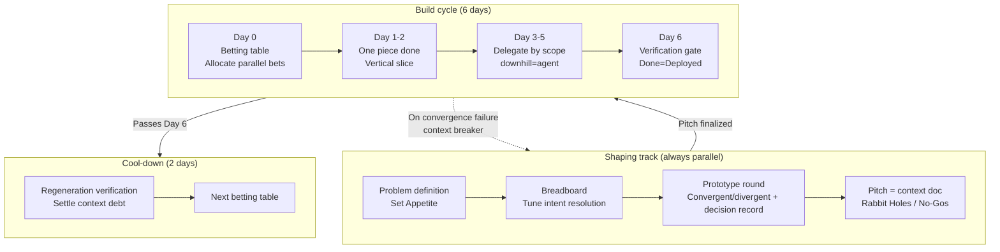

# The 6-Day Cycle — Shape Up Reinterpreted for Vibe Coding

An operating rhythm that redefines the six-week timeboxed cycle of Basecamp's [Shape Up](https://basecamp.com/shapeup) (Ryan Singer) on top of VDLC's premises. It turns Principle 5 of the [Manifesto](/manifesto) ("Run Small Cycles, Feed Back Often") into a concrete team-level heartbeat.

## Why six weeks no longer holds

Shape Up chose six weeks because it was "long enough to finish something meaningful, and short enough to feel the deadline pressure from day one." That calculation rests entirely on the assumption that **humans write the code**.

Vibe coding breaks that assumption. When implementation finishes in minutes or hours, the variable that sets cycle length is no longer build time but **the human time spent on shaping (defining intent) and verification**. The bottleneck has moved, so the timebox has to be redesigned.

Shape Up's mechanisms split three ways.

| Category | The mechanism | Its fate in VDLC |
|---|---|---|
| Survives (reinforced) | Fixed time · variable scope, Shaping, Appetite, No-Gos | As implementation cost converges to zero, scope inflates faster, making the timebox and shaping matter even more |
| Time unit changes | 6-week cycle, 2-week cool-down | Compressed from weeks to days (6-day build + 2-day cool-down) |
| Meaning inverts | Circuit breaker, Betting, Hill chart, "QA is for the edges", "Shaping is senior tacit knowledge" | Detailed below |

## Cycle structure

Keeping the 6-weeks : 2-weeks = 3 : 1 ratio, we substitute days for weeks. **6 working days of build + 2 days of cool-down** = roughly 1.5 weeks is one heartbeat.



### Day-by-day operating rules

| Day | Activity | Completion condition |
|---|---|---|
| Day 0 | Betting table. Review pitches, allocate parallel bets, document the winner-selection criteria in advance | Each bet has its dual budget (human attention + compute) spelled out |
| Day 1–2 | Get one piece done. Integrate a single vertical slice into a deployable state | One end-to-end slice working in a real environment |
| Day 3–5 | Delegation based on the scope map. Downhill scopes are fully delegated to the agent; uphill scopes need human judgment | Every must-have scope has crossed into downhill |
| Day 6 | Verification gate. No coding, verification only | A Done = Deployed verdict |
| Cool-down, day 1 | Regeneration-verification ritual | Regeneration succeeds from the context docs alone, or debt is back-transferred |
| Cool-down, day 2 | Ad-hoc work, bug fixes, preparing the next betting table | — |

### Calibrating cycle length

Six days is a default, not a floor. A cycle is a **re-betting rhythm**, not an estimate of work time. Deployment happens continuously inside the cycle, slice by slice (Done = Deployed from Day 1–2 on), so shortening the cycle buys more frequent decisions, not faster shipping. The right length is therefore a function of three variables.

- **Verification-asset maturity** — as agent cross-review and automated evals absorb more of verification, the human gate takes less time and there is more room to shorten
- **Information arrival rate** — re-betting is only as valuable as the new information (user feedback, operational data) it acts on. Re-betting more often than information arrives just means more meetings over the same facts
- **Understanding bandwidth** — for feedback to be real, people must understand what shipped, and the speed of understanding and curation doesn't compress with compute

On top of that, every cycle carries fixed costs — the betting table, the verification gate, regeneration verification — so over-shortening only raises the overhead-to-output ratio.

| Variant | Shape | For |
|---|---|---|
| Default | 6-day build + 2-day cool-down | Teams at the Practicing maturity level |
| Upward | 10-day build + 3-day cool-down | Enterprises where shaping and consensus need leadership sign-off |
| Downward | 2-day build + 1-day cool-down | Teams at Compounding maturity or above with mature verification assets; solo and small teams |

The floor isn't fixed as a number; it's managed through a calibration procedure.

1. Each cool-down, record the time spent on shaping and the context-breaker trigger rate
2. If breakers fire frequently for two consecutive cycles, it signals too little shaping time — move up one variant
3. If cool-downs stay quiet and the verification gate keeps passing first-try, move down one variant

## The mechanisms whose meaning inverts

### Circuit breaker → context breaker

In Shape Up, a project not finished within the cycle is cancelled by default. In VDLC, when the agent fails to converge it isn't an implementation problem but a **failure of shaping**. The default action isn't cancellation but a **return to the shaping track**.

Trigger conditions (any one fires it immediately — don't wait until Day 6):

1. At the end of Day 2 there is no deployable vertical slice
2. The compute budget is spent while a must-have scope is still uphill
3. The agent repeats three or more mutually contradictory approaches on the same scope

When it fires, the output is a return memo: which intent was unclear, which Rabbit Hole went undeclared.

### Betting → parallel bets (buying options)

In Shape Up a bet was an expensive decision that committed one team for six weeks. In VDLC implementation is cheap, so a bet is an option purchase. For high-uncertainty pitches, **run 2–3 approaches in parallel on the same pitch and pick the winner**.

The winner-selection criteria are documented at the moment of betting on Day 0. Judging by taste after the fact is forbidden. Example criteria: p95 response latency, code regeneration success rate, whether a specific edge case passes.

The currency that sets the ceiling is not compute but **human attention**. The ceiling is however many the human can actually compare and judge against the selection criteria (defaults: 2–3 parallel bets, 2–5 for shaping curation). Compute is allocated freely within the pitch's total appetite.

### Hill chart → delegability map

Shape Up's hill chart was a progress-reporting tool. In VDLC the same chart becomes a **human-agent work-distribution tool**.

- **Uphill scope** = unknowns remain = the stretch that needs human judgment. Do not fully delegate to the agent.
- **Downhill scope** = intent settled = the stretch that can be fully delegated to the agent.
- Moving a scope downhill is a declaration that "this scope's intent is described completely in the context docs."

### QA is for the edges → verification gate

Shape Up's QA covered only edge cases — on the premise that the human implementer had already verified the main flow. VDLC has no such premise. Verification is promoted to an explicit stage, and **all of Day 6 is allocated to it**. No new coding is allowed on Day 6 (only fixing defects found during verification).

Verification-gate checklist:

- [ ] Has the pitch's Problem actually been resolved (compared against baseline)?
- [ ] Are there no No-Gos violations?
- [ ] Main flow verified by a human
- [ ] Edge-case automated tests pass
- [ ] Done = Deployed: deployed to a real environment

## Prototype-driven shaping — vibe coding the decision

Shape Up left shaping in the realm of senior tacit knowledge. It refined solutions with sketches and prose because building prototypes was expensive — the cost of making one exceeded the cost of talking it through. Vibe coding flips that inequality. When implementation cost converges to zero, **"make it and judge" becomes cheaper than "discuss and judge."**

Spending AI's overwhelming productivity only on accelerating implementation is using half of it. The other half is **optimizing decision speed**. Actually using a working prototype yourself gives you a resolution of judgment that a document review can never provide. So VDLC's shaping isn't a documentation activity but an **experimental activity with prototype rounds built in**.

### Two round patterns

| Pattern | Method | Fitting uncertainty |
|---|---|---|
| Convergent (fast iteration) | Build one approach, use it, fix it — repeat quickly | Flow · problem space — "is this the right direction?" |
| Divergent (parallel curation) | Generate 2–5 prototypes for the same problem in parallel; the human compares and chooses | UI · look and feel — taste judgments hard to put into words |

In the divergent pattern the human's role is not making but **curation**. An eye for picking the good one replaces the hand for making the good one. The ceiling on how many to curate is set not by compute but by the human attention available to actually compare and judge.

### The standing of a prototype — the throwaway principle

A prototype is a tool for making a decision, not an artifact.

- No prototype code, including the winner's, is promoted to production. The intent the winner settled is reflected in the pitch and the decision record, then regenerated in the build cycle. This is the shaping-stage application of the core proposition "intent is the primary artifact, code is the secondary artifact."
- But before discarding, always archive it together with the decision record. Even losing prototypes are not thrown away — "why we didn't go down that path" heads off a future re-litigation.

### Auto-generating the decision record

At the end of every prototype round the agent auto-generates a decision record. "Why it was settled in this form" is information that can't be reconstructed from the code, so failing to record it creates context debt at the shaping stage. The decision record is the mechanism that blocks that debt at the moment it would arise.

```markdown
# Decision Record: {round title}

- **Round goal**: {which uncertainty were we trying to resolve}
- **Pattern**: convergent | divergent
- **Approaches tried**: {summary of each prototype + screenshots/links}
- **Winner and rationale**: {what won and why}
- **Reasons for rejection**: {why each losing option was dropped}
- **Reflected into the pitch**: {which part of the pitch this decision changed}
```

The pitch links its related decision records. Spec and prototype are bound by this link, so over the long run the context of "why it was settled in this form" is preserved as a context asset.

## Pitch = context document

In Shape Up the pitch was a document for persuading people at the betting table. In VDLC the pitch is promoted to an **executable primary artifact that the agent consumes directly**.

```markdown
# Pitch: {title}

## 1. Problem
{Not the raw idea but the narrowed problem. baseline: what are users doing today without this?}

## 2. Appetite (dual-currency)
- Human attention budget: shaping {N} hours + verification {N} hours
- Compute budget: {token/session ceiling}
- Batch size: Small (half a day to a day) | Big (the full 6 days)

## 3. Solution
{A breadboard- or fat-marker-level solution. No wireframes (over-specific), no one-line summary (over-abstract).
UI-scope exception: the winning prototype from shaping curation may be attached as an appearance reference}

## 4. Rabbit Holes
{Explicit declaration of the stretches where the agent must escalate to a human rather than deciding on its own}

## 5. No-Gos
{What not to do. If a prohibition isn't stated, the agent will inevitably do it.
The most important ingredient — write at least three}

## 6. (For parallel bets) winner-selection criteria
{Fixed on Day 0. Only measurable criteria allowed}

## 7. Decision-record links
{The list of prototype-round decision records that shaped this pitch}
```

### Intent resolution

A pitch must satisfy three properties: **rough / solved / bounded**.

- **Rough**: implementation details aren't fixed, leaving the agent room to explore the solution
- **Solved**: the key elements and their connections are defined, so the agent doesn't lose its way
- **Bounded**: Appetite and No-Gos block inflation

A wireframe is too specific (it kills the agent's exploration) and a one-line requirement is too abstract (the agent fills it in arbitrarily). Breadboarding (defining only affordances and connections) is the resolution best suited as agent input.

That said, this principle applies to the **structure and logic domain**. UI and look-and-feel are the exception — taste is not something the agent explores but something the human settles, so attaching a curation-settled winning prototype as an appearance reference is not over-specification. How it's implemented still remains the agent's territory to explore.

## Cool-down = regeneration verification

Shape Up's cool-down was time for bug fixes and ad-hoc work. The core ritual of VDLC's cool-down is **regeneration verification**. This is the mechanism that enforces the "intent is the primary artifact" proposition at the process level.

1. Instruct the agent to regenerate the deliverable using only this cycle's context docs (the pitch + updates made during the cycle) as input
2. Check whether the regenerated result passes the verification gate
3. **Pass**: no context debt. Cycle closed.
4. **Fail**: it means undocumented intent is hiding in the code. Analyze the diff and **back-transfer** the hidden intent into the context docs. Betting on the next cycle is forbidden until the back-transfer is complete.

The first task of cool-down is settling not technical debt but **context debt** (decisions that exist in the code but not in the intent docs).

## Terminology mapping

| Shape Up | VDLC 6-day cycle | Gist of the change |
|---|---|---|
| Cycle (6 weeks) | Build cycle (6 days) | Weeks → days. Upward variant 10 days, downward variant 2 days |
| Cool-down (2 weeks) | Cool-down (2 days) | Regeneration verification is the first task |
| Pitch | Context document | Persuasion doc → primary artifact the agent consumes |
| Shaping (senior tacit knowledge) | Prototype-driven shaping | Sketches/prose → judging from working prototypes. Curation is the human's skill |
| Fat marker sketch | Prototype + decision record | Drawing → the real thing. Preserve the decision context as a record before discarding |
| Appetite | Dual-currency Appetite | Human attention budget + compute budget |
| Bet | Parallel bet | Commitment → option purchase. Winner criteria documented in advance |
| Circuit breaker | Context breaker | Cancellation → return to shaping. Early trigger on Day 2 |
| Hill chart | Delegability map | Reporting tool → human-agent work-distribution tool |
| Scope hammering | Context hammering | Not deleting code but editing the intent doc, then regenerating |
| QA is for the edges | Verification gate (Day 6) | Supporting activity → promoted to an explicit stage |
| Technical debt | Context debt | Undocumented intent that exists only in the code |
| Done means deployed | Done = Deployed + regenerable | Adds a regenerability condition to deployment |

::: tip
If you run this cycle with Claude Code, put the following rules in CLAUDE.md so the agent keeps the cycle discipline on its own: no build without a pitch (if there's no pitch, propose drafting one first), escalate instead of self-judging when entering a Rabbit Hole, check No-Gos before every task, return a question list of unresolved intent when an uphill scope gets a "just handle it" instruction, submit design decisions not in the pitch as a context-doc update proposal at task end, report progress when 50% of the compute budget is spent, auto-generate a decision record at the end of a prototype round, and never promote prototype code to production.
:::
