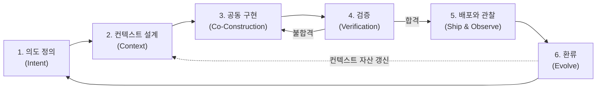

## VDLC란

VDLC(Vibe-Driven Development Lifecycle)는 AI 에이전트가 코드 구현의 주체가 되는 시대에 맞춰 소프트웨어 개발의 전 과정을 재구성한 개발 생명주기다. 핵심 명제는 하나다. **의도와 컨텍스트가 1차 산출물이고, 코드는 그로부터 재생성 가능한 2차 산출물이다.**

## 라이프사이클: 여섯 단계

## 왜 지금인가

바이브코딩이 실무로 들어오며 코드를 작성하는 비용은 사실상 0에 수렴하고 있다. 문제는 생명주기의 나머지 구간이 그대로라는 점이다. 기존 SDLC를 그대로 두고 구현 단계에만 AI를 끼워 넣으면 세 가지 문제가 반복된다.

- **속도 불균형** — 구현만 빨라지고 앞뒤 구간이 그대로면 전체 리드타임은 거의 줄지 않는다.
- **품질 리스크** — 검증 체계 없이 생성 속도만 누리면 데모에서는 화려하지만 유지보수 불가능한 코드를 양산한다.
- **지식의 휘발** — 프롬프트와 대화 속 의사결정과 도메인 지식은 세션이 끝나면 사라지고, 다음 작업은 맨바닥에서 다시 시작한다.

VDLC는 이 세 문제를 정면으로 다뤄, 병목이 된 구간을 생명주기의 중심에 두고 휘발되던 지식을 컨텍스트 자산으로 축적하는 구조를 만든다.

## 더 알아보기

- [매니페스토](/manifesto) — VDLC의 정의, 배경, 다섯 가지 원칙, 기존 방법론과의 관계를 담은 원문
- [실무 가이드](/guide/intent) — 여섯 단계 각각을 실행하는 방법을 다루는 플레이북
- [템플릿](/templates) — 의도 문서, PR-FAQ, 리스크 매트릭스 등 반복 사용하는 문서 양식
- [도입 사례](/cases) — 중견기업과 소규모 팀이 VDLC를 도입한 두 편의 이야기
- [도입](/adoption) — 성숙도 모델, 도입 로드맵, 측정 지표로 조직 도입 경로를 설계하는 문서
