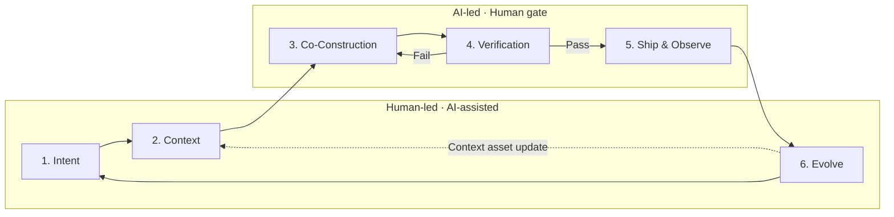

## What VDLC Is

VDLC (Vibe-Driven Development Lifecycle) is a development lifecycle that reconstructs the entire software development process for an era in which AI agents are the ones implementing code. Its core proposition is a single one: **intent and context are the primary artifacts, and code is a secondary artifact regenerable from them.**

## The Lifecycle: Six Stages

Intent, Context, and Evolve (stages 1, 2, 6) are led by humans and assisted by AI. Co-Construction, Verification, and Ship & Observe (stages 3, 4, 5) are led by AI, but humans guard the gates of plan approval, final review, and deploy approval.

## Why Now

As vibe coding moves into practice, the cost of writing code is effectively converging to zero. The problem is that the rest of the lifecycle stays the same. If you leave the existing SDLC in place and slot AI only into the implementation stage, four problems recur.

- **Speed imbalance** — If only implementation gets faster while the stages before and after stay the same, total lead time barely shrinks.
- **Quality risk** — Enjoying generation speed without a verification system mass-produces code that dazzles in a demo but is impossible to maintain.
- **Knowledge evaporation** — Decisions and domain knowledge scattered through prompts and conversations vanish when the session ends, and the next task starts from bare ground again.
- **Capability erosion** — When approving code you don't understand becomes routine, cognitive debt accumulates, and the number of people who can judge the code steadily shrinks.

VDLC tackles these four problems head-on: it places the bottleneck stages at the center of the lifecycle, accumulates evaporating knowledge as context assets, and builds a structure in which a person's understanding grows along the way.

## Learn More

- [Manifesto](/manifesto) — the full text covering VDLC's definition, background, six principles, and relationship to existing methodologies
- [Practical Guide](/guide/intent) — a playbook covering how to execute each of the six stages
- [Templates](/templates/) — reusable document formats such as intent documents, PR-FAQs, and risk matrices
- [Adoption](/adoption/) — documents for designing an organizational adoption path with a maturity model, roadmap, and metrics
