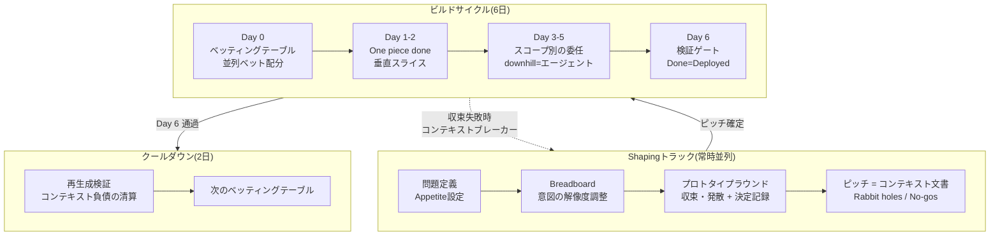

# 6日サイクル — Shape Upのバイブコーディング再解釈

Basecamp [Shape Up](https://basecamp.com/shapeup)(Ryan Singer)の6週間タイムボックスサイクルを、VDLCの前提のうえで再定義した運営リズムだ。[マニフェスト](/ja/manifesto)の原則5(「小さく回し、頻繁に還流する」)を、チーム単位の具体的な心拍(heartbeat)として実装する。

## なぜ6週間をそのまま使えないのか

Shape Upが6週間を選んだ根拠は、「意味あるものを完成させるのに十分長く、始めから締切のプレッシャーを感じるほどに短い期間」というものだった。この計算はすべて、**人間がコードを書く**という仮定のうえに立っている。

バイブコーディングはこの仮定を崩した。実装が分・時間単位で終わるなら、サイクルの長さを決める変数はビルド時間ではなく、**shaping(意図定義)と検証にかかる人間の時間**だ。ボトルネックが移動したのだから、タイムボックスも再設計しなければならない。

Shape Upの仕掛けは三つに分かれる。

| 分類 | 該当する仕掛け | VDLCでの運命 |
|---|---|---|
| 生き残る(強化) | Fixed time・variable scope, Shaping, Appetite, No-Gos | 実装コストの0収束によりスコープ膨張の速度が上がり、タイムボックスとshapingがより重要になる |
| 時間単位の変更 | 6週間サイクル、2週間クールダウン | 週→日単位へ圧縮(6日ビルド + 2日クールダウン) |
| 意味の反転 | Circuit breaker, Betting, Hill chart, QA is for the edges, 「Shapingはシニアの暗黙知」 | 以下で詳述 |

## サイクル構造

6週間:2週間 = 3:1の比率を保ちながら、週を日に置き換える。**6営業日ビルド + 2日クールダウン** = 約1.5週間が一つの心拍だ。



### Day別の運営ルール

| Day | 活動 | 完了条件 |
|---|---|---|
| Day 0 | ベッティングテーブル。ピッチ検討、並列ベットの配分、勝者選定基準の事前文書化 | 各ベットに二重予算(人間の注意力 + コンピュート)を明示済み |
| Day 1–2 | Get one piece done. 垂直スライス一つをデプロイ可能な状態へ統合 | 実環境で動作するend-to-endスライス1個 |
| Day 3–5 | スコープマップに基づく委任。downhillスコープはエージェントへ完全委任、uphillスコープは人間の判断 | すべてのmust-haveスコープがdownhillへ突入 |
| Day 6 | 検証ゲート。コーディング禁止、検証専用 | Done = Deployed 判定 |
| クールダウン1日目 | 再生成検証の儀式 | コンテキスト文書のみで再生成成功、または負債の逆転写完了 |
| クールダウン2日目 | ad-hoc作業、バグ修正、次のベッティングテーブルの準備 | — |

### サイクル長のキャリブレーション

6日はデフォルト値であって下限ではない。サイクルは作業時間の見積もりではなく**再ベットのリズム**だ。デプロイはサイクルの中でスライス単位に随時起こるため(Day 1–2からDone = Deployed)、サイクルを縮めて得られるのはより速いデプロイではなく、より頻繁な意思決定だ。したがって適正な長さは3つの変数の関数だ。

- **検証資産の成熟度** — エージェントの相互レビュー・自動評価が検証を吸収するほど、人間のゲートの所要時間が減り、短縮の余地が広がる
- **情報の到着速度** — 再ベットの価値は新しい情報(ユーザーフィードバック、運用データ)の到着速度に縛られる。情報より頻繁な再ベットは、同じ情報で会議を増やすだけだ
- **理解の帯域幅** — 還流が実質になるには人が成果物を理解しなければならず、理解とキュレーションの速度はコンピュートでは圧縮されない

さらに、ベッティングテーブル・検証ゲート・再生成検証というサイクルごとの固定費があるため、過度な短縮は成果物に対するオーバーヘッド比率を高めるだけだ。

| バリアント | 構成 | 適用対象 |
|---|---|---|
| デフォルト | 6日ビルド + 2日クールダウン | 成熟度が実践(Practicing)水準のチーム |
| 上方 | 10日ビルド + 3日クールダウン | shaping・合意にリーダーシップの承認が必要なエンタープライズ |
| 下方 | 2日ビルド + 1日クールダウン | 検証資産が成熟した資産化(Compounding)以上のチーム、ソロ・小規模チーム |

下限は数値で固定せず、キャリブレーション手順で管理する。

1. クールダウンごとにshapingの所要時間とコンテキストブレーカーの発動率を記録する
2. ブレーカーが2サイクル連続で頻発すれば、shaping時間の不足シグナルだ — 一段階長いバリアントへ延長する
3. クールダウンが継続的に閑散とし、検証ゲートが一発通過を維持していれば、一段階短いバリアントへ短縮する

## 意味が反転した仕掛け

### Circuit breaker → コンテキストブレーカー

Shape Upではサイクル内の未完了プロジェクトは基本的にキャンセルされる。VDLCでは、エージェントが収束できないなら実装の問題ではなく**shapingの失敗**だ。デフォルトの動作はキャンセルではなく、**shapingトラックへの差し戻し**だ。

発動条件(一つでも満たせば即時発動、Day 6まで待たない)。

1. Day 2終了時点でデプロイ可能な垂直スライスがない
2. コンピュート予算を使い切ったのにmust-haveスコープがuphillに残っている
3. エージェントが同一スコープで3回以上、相互に矛盾するアプローチを繰り返す

発動時の成果物は差し戻し理由書だ。どの意図が不明確だったか、どのRabbit holeが未宣言だったか。

### Betting → 並列ベット(オプション買い)

Shape Upではベットは一つのチームを6週間拘束する高価な決定だった。VDLCでは実装が安いため、ベットはオプション買いだ。不確実性の高いピッチには、**同一ピッチに2〜3個のアプローチを並列で賭けて勝者を選ぶ**。

勝者選定基準はDay 0のベット時点で文書化する。事後の好み判定を禁止する。基準の例。応答遅延p95、コード再生成の成功率、特定エッジケースの通過可否。

上限を決める通貨はコンピュートではなく、**人間の注意力**だ。勝者選定基準に沿って人間が実際に比較・判定できる数が上限だ(デフォルト値。並列ベット2〜3個、shapingキュレーション2〜5個)。コンピュートはピッチのappetite総額の範囲で自由に配分する。

### Hill chart → 委任可能性マップ

Shape Upのhill chartは進捗報告ツールだった。VDLCでは同じチャートが**人間-エージェントの業務分配ツール**になる。

- **uphillスコープ** = 未知の残存 = 人間の判断が必要な区間。エージェントへの完全委任を禁止。
- **downhillスコープ** = 意図の確定 = エージェントへ完全委任できる区間。
- スコープをdownhillへ渡すとは、「このスコープの意図がコンテキスト文書に完結的に記述された」という宣言だ。

### QA is for the edges → 検証ゲート

Shape UpのQAはエッジケースのみを扱った — 人間の実装者がメインフローをすでに検証したという前提だった。VDLCにはその前提がない。検証が明示的なステージへ昇格し、**Day 6全体が検証に割り当てられる**。Day 6には新規コーディングを禁止する(検証中に発見された欠陥の修正のみ許可)。

検証ゲートのチェックリスト。

- [ ] ピッチのProblemが実際に解消されたか(baselineとの比較)
- [ ] No-Gos違反がないか
- [ ] メインフローの人間検証完了
- [ ] エッジケースの自動テスト通過
- [ ] Done = Deployed: 実環境へのデプロイ完了

## プロトタイプ主導のShaping — 意思決定のバイブコーディング

Shape Upはshapingをシニアの暗黙知の領域として残した。スケッチと文章で解法を練ったのは、プロトタイプ制作が高価だったからだ — 作ってみるコストが議論するコストより大きかった。バイブコーディングはこの不等号を逆転させた。実装コストが0に収束すれば、**「作ってみて判断」が「議論して判断」より安い**。

AIの圧倒的な生産性を実装の加速だけに使うのは、半分の活用だ。残りの半分は**意思決定の速度の最適化**だ。動作するプロトタイプを実際に使ってみた経験は、文書レビューでは提供できない解像度の判断根拠を与える。したがってVDLCのshapingは文書活動ではなく、**プロトタイプラウンドを内蔵した実験活動**だ。

### 二つのラウンドパターン

| パターン | 方法 | 適した不確実性 |
|---|---|---|
| 収束型(高速反復) | 一つのアプローチを作り、使ってみて、直すことを素早く反復 | フロー・問題空間 — 「この方向で合っているか」 |
| 発散型(並列キュレーション) | 同一問題に2〜5個のプロトタイプを並列生成し、人間が比較のうえ選択 | UI・ルックアンドフィール — 言語化しにくい好みの判断 |

発散型での人間の役割は制作ではなく**キュレーション**だ。良いものを選び出す目利きが、良いものを作る手を代替する。キュレーションの数の上限はコンピュートではなく、人間が実際に比較・判定できる注意力だ。

### プロトタイプの地位 — throwaway原則

プロトタイプは決定のための道具であり、成果物ではない。

- 勝者を含むすべてのプロトタイプコードは、プロダクションへ昇格しない。勝者が確定した意図はピッチ・決定記録に反映されたのち、ビルドサイクルで再生成される。「意図が一次成果物、コードは二次成果物」という核心命題のshaping版の適用だ。
- ただし、廃棄の前に必ず決定記録とともにアーカイブする。落選したプロトタイプも捨てない — 「なぜその道へ行かなかったのか」が未来の再議論を遮断する。

### 決定記録(Decision Record)の自動生成

プロトタイプラウンドが終わるたびに、エージェントが決定記録を自動生成する。「なぜこの形に決まったのか」はコードから再構成できない情報であるため、記録しなければshaping段階でコンテキスト負債が発生する。決定記録はこれを発生時点で遮断する仕掛けだ。

```markdown
# 決定記録: {ラウンドのタイトル}

- **ラウンドの目的**: {どの不確実性を解消しようとしたか}
- **パターン**: 収束型 | 発散型
- **試したアプローチ**: {各プロトタイプの要約 + スクリーンショット/リンク}
- **勝者と選定根拠**: {何が勝ち、なぜ}
- **落選理由**: {各落選案がなぜ捨てられたか}
- **ピッチへの反映事項**: {この決定がピッチのどの部分を変えたか}
```

ピッチは関連する決定記録をリンクする。スペックとプロトタイプがこのリンクで結ばれ、長期的に「なぜこの形に決まったのか」の文脈がコンテキスト資産として保存される。

## ピッチ = コンテキスト文書

Shape Upではピッチはベッティングテーブルで人を説得する文書だった。VDLCではピッチは**エージェントが直接消費する実行可能な一次成果物**へ昇格する。

```markdown
# ピッチ: {タイトル}

## 1. Problem
{生のアイデアではなく、絞り込まれた問題。baseline: いまユーザーはこれなしで何をしているか}

## 2. Appetite(二重通貨)
- 人間の注意力予算: shaping {N}時間 + 検証 {N}時間
- コンピュート予算: {トークン/セッション上限}
- バッチサイズ: Small(半日〜1日) | Big(6日全体)

## 3. Solution
{breadboard または fat markerレベルの解法。ワイヤーフレーム禁止(過剰に具体)、一行要約禁止(過剰に抽象)。
UIスコープの例外: shapingキュレーションの勝者プロトタイプを外観の基準点として添付可能}

## 4. Rabbit Holes
{エージェントが自ら判断せず人間へエスカレーションすべき区間の明示的宣言}

## 5. No-Gos
{やらないこと。エージェントは禁止を明示しなければ必ずやる。
最も重要な材料 — 最低3個以上を記述}

## 6. (並列ベット時)勝者選定基準
{Day 0に確定。測定可能な基準のみ許可}

## 7. 決定記録リンク
{このピッチの形を決めたプロトタイプラウンドの決定記録の一覧}
```

### 意図の解像度

ピッチは **rough / solved / bounded** の三つの属性を満たさなければならない。

- **Rough**: 詳細な実装を確定せず、エージェントに解法探索の余地を残す
- **Solved**: 核心要素と接続関係が定義されており、エージェントが方向を見失わない
- **Bounded**: Appetite・No-Gosで膨張を遮断する

ワイヤーフレームは具体的すぎ(エージェントの探索を殺す)、一行の要求は抽象的すぎる(エージェントが勝手に埋める)。breadboarding(アフォーダンスと接続のみを定義)がエージェント入力として最も適した解像度だ。

ただし、この原則は**構造・ロジックの領域**に適用される。UI・ルックアンドフィールは例外だ — 好みはエージェントが探索する対象ではなく人間が確定する対象であるため、キュレーションで確定した勝者プロトタイプを外観の基準点として添付することは過剰な具体ではない。実装方式は依然としてエージェントの探索領域として残る。

## クールダウン = 再生成検証

Shape Upのクールダウンはバグ修正とad-hoc作業の時間だった。VDLCのクールダウンの核心の儀式は**再生成検証**だ。これが「意図が一次成果物」という命題をプロセスのレベルで強制する仕掛けだ。

1. 今回のサイクルのコンテキスト文書(ピッチ + サイクル中の更新分)のみを入力として、エージェントに成果物の再生成を指示する
2. 再生成物が検証ゲートを通過するか確認する
3. **通過**: コンテキスト負債なし。サイクル終了。
4. **失敗**: コードに文書化されていない意図が隠れているという意味だ。diffを分析して隠れた意図をコンテキスト文書へ**逆転写**する。逆転写の完了前には次のサイクルのベットを禁止する。

技術負債ではなく**コンテキスト負債**(コードにはあるが意図文書にはない決定)の清算が、クールダウンの第一の課業だ。

## 用語対応表

| Shape Up | VDLC 6日サイクル | 変更の要旨 |
|---|---|---|
| Cycle(6週間) | ビルドサイクル(6日) | 週→日。上方バリアント10日、下方バリアント2日 |
| Cool-down(2週間) | クールダウン(2日) | 再生成検証が第一の課業 |
| Pitch | コンテキスト文書 | 説得用文書 → エージェントが消費する一次成果物 |
| Shaping(シニアの暗黙知) | プロトタイプ主導のshaping | スケッチ・文章 → 動作するプロトタイプで判断。キュレーションが人間の力量 |
| Fat marker sketch | プロトタイプ + 決定記録 | 絵 → 実物。廃棄前に決定の文脈を記録で保存 |
| Appetite | 二重通貨のAppetite | 人間の注意力予算 + コンピュート予算 |
| Bet | 並列ベット | コミット → オプション買い。勝者基準を事前文書化 |
| Circuit breaker | コンテキストブレーカー | キャンセル → shaping差し戻し。Day 2の早期発動 |
| Hill chart | 委任可能性マップ | 報告ツール → 人間-エージェントの業務分配ツール |
| Scope hammering | コンテキストハンマリング | コード削除ではなく意図文書の修正後に再生成 |
| QA is for the edges | 検証ゲート(Day 6) | 補助活動 → 明示的ステージへ昇格 |
| Technical debt | コンテキスト負債 | コードのみに存在する未文書化の意図 |
| Done means deployed | Done = Deployed + 再生成可能 | デプロイに再生成可能性の条件を追加 |

::: tip
Claude Codeでこのサイクルを運営するなら、次のルールをCLAUDE.mdに入れて、エージェントがサイクルの規律を自ら守るようにする。ピッチなしのビルド禁止(ピッチがなければ草案作成をまず提案)、Rabbit hole突入時は自己判断ではなくエスカレーション、No-Gosを毎作業前に確認、uphillスコープの「よしなにやってくれ」という指示には未解決の意図を質問リストとして返す、ピッチにない設計決定は作業終了時にコンテキスト文書の更新案として提出、コンピュート予算の50%消費時に進捗報告、プロトタイプラウンド終了時に決定記録を自動生成、プロトタイプコードのプロダクション昇格を禁止。
:::
