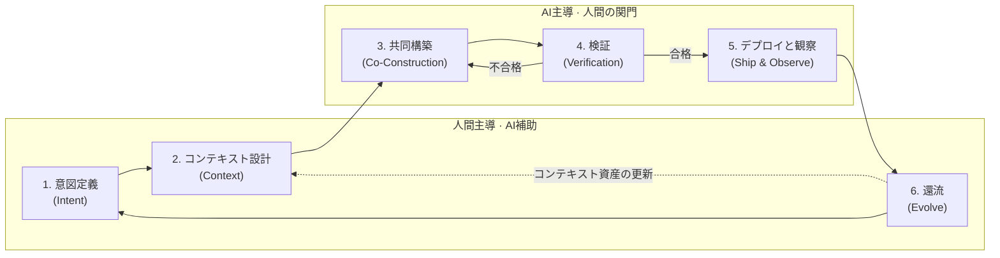

## VDLCとは

VDLC(Vibe-Driven Development Lifecycle)は、AIエージェントがコード実装の主体となる時代に合わせてソフトウェア開発の全過程を再構成した開発ライフサイクルだ。核心命題は一つ。**意図とコンテキストが一次成果物であり、コードはそこから再生成可能な二次成果物だ。**

## ライフサイクル: 六つのステージ

意図定義、コンテキスト設計、還流(ステージ1・2・6)は人間が主導しAIが補助する。共同構築、検証、デプロイと観察(ステージ3・4・5)はAIが主導するが、計画承認・最終レビュー・デプロイ承認の関門は人間が守る。

## なぜ今なのか

バイブコーディングが実務に入り込み、コードを書くコストは事実上0へ収束しつつある。問題は、ライフサイクルの残りの区間がそのままだという点だ。既存のSDLCをそのままにして実装ステージだけにAIを差し込むと、四つの問題が繰り返される。

- **速度の不均衡** — 実装だけが速くなり前後の区間がそのままなら、全体のリードタイムはほとんど縮まらない。
- **品質リスク** — 検証体系なしに生成速度だけを享受すると、デモでは華やかだが保守不能なコードを量産する。
- **知識の揮発** — プロンプトや対話の中の意思決定とドメイン知識はセッションが終わると消え、次の作業はまっさらな状態からやり直しになる。
- **能力の浸食** — 理解できないコードを承認することが繰り返されると認知負債(cognitive debt)が積み上がり、コードを判断できる人が次第に減っていく。

VDLCはこの四つの問題を正面から扱い、ボトルネックとなった区間をライフサイクルの中心に据え、揮発していた知識をコンテキスト資産として蓄積し、人の理解がともに育つ構造を作る。

## さらに知る

- [マニフェスト](/ja/manifesto) — VDLCの定義、背景、六つの原則、既存方法論との関係を収めた原文
- [実務ガイド](/ja/guide/intent) — 六つのステージそれぞれを実行する方法を扱うプレイブック
- [テンプレート](/ja/templates/) — 意図文書、PR-FAQ、リスクマトリクスなど繰り返し使う文書様式
- [導入](/ja/adoption/) — 成熟度モデル、導入ロードマップ、測定指標で組織導入の経路を設計する文書
