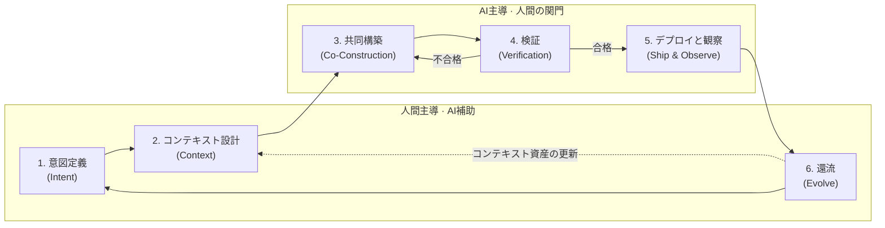

# VDLC: Vibe-Driven Development Lifecycle

**バイブコーディングを前提に再設計したソフトウェア開発ライフサイクル**

---

## 1. 定義

VDLC(Vibe-Driven Development Lifecycle)は、AIエージェントがコード実装の主体となる時代に合わせてソフトウェア開発の全過程を再構成した開発ライフサイクルだ。人間は意図を定義しコンテキストを設計し結果を検証し、AIエージェントは計画を提案しコードを生成し自ら点検する。

伝統的なSDLCは「人間がコードを書く」という仮定の上に築かれた。要求分析–設計–実装–テスト–デプロイと続くステージ区分も、スプリントという時間単位も、コードレビューという品質装置も、すべてこの仮定から出発する。バイブコーディングはこの仮定を崩した。VDLCは崩れた仮定を新しい仮定へ置き換えたうえで、その上に開発プロセスを一から立て直した成果物だ。

VDLCの核心命題は一つ。**意図とコンテキストが一次成果物であり、コードはそこから再生成可能な二次成果物だ。**

## 2. 背景: なぜ今VDLCなのか

2025年初頭にアンドレイ・カルパシー(Andrej Karpathy)が「バイブコーディング」と名付けて以来、自然言語で意図を伝えるとAIが動作するコードを作り出す開発方式は、実験を越えて実務に入り込んだ。コードを一行書くコストは事実上0へ収束しつつある。

問題は、ライフサイクルの残りの区間がそのままだという点だ。実装が分単位で終わるのに、要求定義は依然として会議を何度も経て、レビューは人の手を何日も待つ。ボトルネックが「コードを書く仕事」から「何を作るか決める仕事」と「作られたものを信じられるか確かめる仕事」へ移動したのだ。既存のSDLCをそのままにして実装ステージだけにAIを差し込むと、四つの問題が繰り返される。

第一に、**速度の不均衡**だ。実装だけが速くなり前後の区間がそのままなら、全体のリードタイムはほとんど縮まらず、組織は「AIを導入したのになぜ速くならないのか」という問いに突き当たる。第二に、**品質リスク**だ。検証体系なしに生成速度だけを享受する開発は、デモでは華やかだがプロダクションでは保守不能なコード、いわゆるAIスロップを量産する。第三に、**知識の揮発**だ。プロンプトや対話の中に散らばった意思決定とドメイン知識はセッションが終わると消え、次の作業はまたまっさらな状態から始まる。第四に、**能力の浸食**だ。理解できないコードを承認することが繰り返されると、コードベースは急速に育つのに、そのコードを判断できる人は次第に減っていく。この格差は認知負債(cognitive debt)として積み上がり、ある時点で組織は自らが所有するシステムを説明できなくなる。

VDLCはこの四つの問題を正面から扱う。ボトルネックとなった区間(意図定義、検証)をライフサイクルの中心に据え、揮発していた知識をコンテキスト資産として蓄積し、人の理解がともに育つ構造を作る。

## 3. 六つの原則

**原則1 — 意図がソースだ (Intent as Source)。** プログラミング言語で書いたコードではなく、自然言語で書いた意図が開発の出発点であり原本だ。よく書かれた意図文書は、一度書いて捨てる要求仕様ではなく、エージェントに繰り返し投入される実行可能なスペックである。アマゾンの6-pagerやPR-FAQのようなナラティブ文書がよい形式である理由は、文脈・根拠・トレードオフを物語として盛り込み、エージェントが行間を推測する必要を減らしてくれるからだ。

**原則2 — 人間は判断し、AIは実行する。** 何を作るか、どこまで許すか、この結果を信じるかは人間の役目だ。どう実装するか、反復作業をどう処理するかはエージェントの役目だ。この境界が崩れると両側とも事故が起きる。判断まで委譲すれば制御を失い、実行まで人間が握れば速度を失う。

**原則3 — 速度は検証が決める (Verification Sets the Pace)。** 生成はもはやボトルネックではない。全体のリードタイムは「どれだけ速く作るか」ではなく「作られたものをどれだけ速く信じられるか」が決める。したがって、テスト、評価基準、レビュー体系といった検証資産に投資することが、そのまま速度に投資することだ。

**原則4 — コンテキストは資産だ (Context as Asset)。** プロジェクトルール(CLAUDE.md)、再利用可能なスキル、ドメインwiki、コーディング規約は付随的な文書ではなく、組織の中核資産だ。同じモデルを使ってもコンテキストの品質によって成果物の品質が分かれる。VDLCは、サイクルを回すたびにこの資産が厚くなり、資産が厚くなるほど次のサイクルが速くなる複利構造を設計する。

**原則5 — 小さく回し、頻繁に還流する。** 一サイクルの単位は週単位のスプリントではなく時間と日だ。小さな単位で意図–実装–検証を回し、各サイクルで学んだことを即座にコンテキストへ反映する。

**原則6 — 理解が所有だ (Understanding as Ownership)。** エージェントが作ったコードを承認した瞬間、そのコードの責任は承認した人のものになる。理解しないまま承認した成果物は認知負債として積み上がり、技術的負債のように複利で膨らむ。サイクルを回すたびにコンテキスト資産だけが厚くなってはならず、人の理解もともに育たねばならない。だからVDLCは、学習を個人の選択ではなくライフサイクルに組み込まれた活動として扱う。

## 4. ライフサイクル: 六つのステージ

六つのステージは主導者が異なる。意図定義、コンテキスト設計、還流(ステージ1・2・6)は人間が主導しAIが補助する。共同構築、検証、デプロイと観察(ステージ3・4・5)はAIが主導するが、各ステージの関門—計画承認、最終レビュー、デプロイ承認—は人間が守る。主導権を渡すことと判断を渡すことは違う。原則2の境界は、まさにこれらの関門としてライフサイクルに実装される。

### ステージ1 — 意図定義 (Intent)

*主導: 人間 · 補助: AI*

何を、なぜ作るのかを人が合意し文書にする。成果物はナラティブ形式の意図文書だ。PR-FAQで完成した姿を先に描き、6-pager形式で背景・制約・トレードオフを叙述し、検証可能な成功基準を明示する。このステージの品質が以降すべてのステージの上限を定める。曖昧な意図はエージェントの推測を招き、推測は手戻りを招く。

→ [ステージ1プレイブック](/ja/guide/intent)

### ステージ2 — コンテキスト設計 (Context)

*主導: 人間 · 補助: AI*

エージェントが参照する知識とルールを用意する。プロジェクトルール、アーキテクチャ決定記録、コーディング規約、ドメイン用語集、再利用スキルがこれに当たる。新規プロジェクトなら最小限の骨格を立て、既存プロジェクトなら前サイクルで蓄積された資産を点検し更新する。

→ [ステージ2プレイブック](/ja/guide/context)

### ステージ3 — 共同構築 (Co-Construction)

*主導: AI · 関門: 人間(計画承認)*

エージェントが計画を提案し、人間が承認すると、エージェントが実装する。核心は「計画承認」の関門だ。コードを一行ずつ検討する代わりに計画レベルで方向を制御すれば、制御力を保ちつつ生成速度を丸ごと享受できる。作業は独立に検証可能な小さな単位に分割し、単位ごとに複数のエージェントを並列にオーケストレーションできる。承認関門が形式的なクリックにならないためには、承認前に計画を自分の言葉で要約してエージェントに問い返して確認する。要約がずれるなら、それは計画の問題である以前に理解の問題であり、理解できない計画は承認しないのが原則だ。

→ [ステージ3プレイブック](/ja/guide/build)

### ステージ4 — 検証 (Verification)

*主導: AI · 関門: 人間(最終レビュー)*

作られたものを信じられるか確かめる。自動化されたテストと静的解析が第一の防衛線、別のエージェントによる交差レビューが第二、人間レビューが最終の関門だ。すべての成果物に同じ強度を適用する代わりに、リスクに比例して検証強度を調整する。決済・認証・個人情報のように失敗コストが大きい領域は人間レビューを強化し、内部ツールやプロトタイプは自動検証中心で軽く通過させる。検証で見つかった問題はコード修正で終わらせず、意図文書やコンテキストの欠陥まで追跡して直す。検証の対象には成果物だけでなく承認者の理解も含まれる。リスクが高い変更は「承認者がこのコードを説明できるか」を通過基準に入れる。自分が理解したことをエージェントに説明して合っているか確認してもらう説明の問い返し、エージェントとともに変更点を辿るコードウォークスルーが有効な道具だ。

→ [ステージ4プレイブック](/ja/guide/verify)

### ステージ5 — デプロイと観察 (Ship & Observe)

*主導: AI · 関門: 人間(デプロイ承認)*

検証を通過した成果物をデプロイし運用データを観察する。CI/CDパイプラインと観測ツールはVDLCが機能するための前提条件だ。運用で見つかった課題は、ログ、再現手順、期待動作を備えた再現可能なコンテキストとして整理し、次サイクルの入力にする。

→ [ステージ5プレイブック](/ja/guide/ship)

### ステージ6 — 還流 (Evolve)

*主導: 人間 · 補助: AI*

サイクルで学んだことを資産に反映する。繰り返された指示はプロジェクトルールへ、検証で捕まえた誤りのパターンはレビューチェックリストへ、新たに整理されたドメイン知識はwikiへ入る。このステージを省くとVDLCはただの速いコーディングにすぎない。還流があってこそ、サイクルを回すほど組織が賢くなる学習ループが完成する。還流の対象はコンテキスト資産だけではない。サイクルで初めて出会ったパターンや技術を振り返って自分の言葉で整理し、理解しないまま通り過ぎた点があればここで償還する。組織の資産と個人の理解がともに育ってこそ、次サイクルの判断が速くなる。

→ [ステージ6プレイブック](/ja/guide/evolve)

## 5. 役割の再定義

VDLCにおいて開発者はコードの書き手ではなく、三つの役割の結合体になる。意図を明確な文書へ鍛え上げる**意図設計者**、複数のエージェントに仕事を配分し進行を調整する**オーケストレーター**、結果を信じるか判断する**検証者**だ。タイピング熟練度の価値は減り、問題定義力とシステム設計の感覚とレビューの眼識の価値が高まる。そしてこの三つの役割を支える土台は学習だ。サイクルを回すたびに自らの理解を更新しない開発者は、検証者の役割からまず崩れる。

非開発職の参加範囲も広がる。企画者やドメイン専門家は意図文書作成の共同主体となり、プロトタイプ水準の実装は自ら行える。ただしステージ4検証の最終責任は、プロダクション品質を判断できるエンジニアに残る。

## 6. 成果物の再定義

| 区分 | 伝統的SDLC | VDLC |
|---|---|---|
| 一次成果物 | コード | 意図文書、コンテキスト資産、検証資産 |
| コードの位置づけ | 手作業で作った原本 | 再生成可能な二次成果物 |
| 文書の位置づけ | コードを追う記録(しばしば放置される) | コードに先立つスペック(エージェントの入力) |
| 蓄積されるもの | コードベース | コードベース + コンテキスト資産 + 評価基準 + 人の理解 |

この転換の実務的意味は明確だ。文書化は開発を遅らせるコストではなく、次の生成の品質を引き上げる投資へと変わる。

## 7. 既存方法論との関係

VDLCは既存方法論を否定せず、その上に立つ。**アジャイル**の反復とフィードバックの精神はそのまま継承しつつ、反復周期を週単位のスプリントから時間・日単位のサイクルへ圧縮する。**DevOps**が築いたCI/CDと観測インフラは、ステージ4とステージ5が機能するための土台だ。**TDD**の「検証基準を先に立てる」という思考は原則3へ拡張される。

AWSの**AI-DLC**とは問題意識を共有する。AI-DLCがInception–Construction–Operationsという組織レベルの青写真とモブ(Mob)中心の協働儀礼を提示するなら、VDLCはバイブコーディングの実践を中心に据え、個人とチームが日々回す実行ループとコンテキスト資産化の構造を具体化する。二つの方法論は競合関係ではなく、組織視点のフレーム(AI-DLC)と実務視点のサイクル(VDLC)として相互補完的に使える。

## 8. アンチパターン

**検証なきバイブ。** 生成速度に酔ってステージ4を飛ばす場合だ。初期には速く前進するように見えるが、理解できないコードが積み上がるにつれ、ある時点から一つの修正が回帰バグを三つ生む。デモには到達するがプロダクションには到達しない、典型的な経路だ。

**コンテキストなきプロンプト。** 毎セッションをまっさらな状態から始める場合だ。同じ指示を繰り返し、セッションごとにスタイルと構造が変わり、チームメンバー間の成果物の一貫性が崩れる。還流(ステージ6)が機能していない組織の症状だ。

**ボトルネックと化した人間。** 生成は分単位なのにレビュー体系は以前のままの場合だ。エージェントが作った成果物がレビュー待ち行列に積み上がり、AI導入の効果が待ち時間に蝕まれる。リスクベースの検証強度調整やエージェント交差レビューといった検証体系の再設計が必要だという信号だ。

**全区間自動化の幻想。** 判断までエージェントに委譲する場合だ。要求解釈、アーキテクチャ選択、デプロイ承認といった判断ポイントで人間の関門を取り除くと、速く間違った方向へ遠くまで進んでしまう。原則2の境界は自動化水準が上がっても維持されねばならない。

**理解なき承認。** 関門ごとに承認ボタンを押すだけの場合だ。当座はサイクルが滑らかに回るが、認知負債が積み上がるにつれレビューの眼識そのものが浸食され、ある時点で「人間は判断する」という原則2が空虚になる。判断できない人が守る関門は関門ではない。

## 9. 導入経路

組織導入はパイロット → コンテキスト資産化 → チーム単位の拡散 → 組織標準化の4つのステップで進める。失敗コストが低い内部ツールや新規の小規模プロジェクトでまず六つのステージ全体を経験し、そこから出たルールと知識を再利用可能なコンテキスト資産として整理したうえで、テスト基準・レビュールール・リスク等級を備えた検証体系でチーム単位の拡散を経て、サイクルリードタイム・手戻り率・コンテキスト資産の増加量といった指標で組織標準として定着させる。

各ステップの目標、やるべきこと、完了信号は[導入ロードマップ](/ja/adoption/roadmap)で詳しく扱う。

## 結びに

バイブコーディングは道具の変化ではなく仮定の変化だ。「人間がコードを書く」という仮定が消えた跡地に何を立てるかについての一つの答えがVDLCだ。意図を原本とし、検証で速度を作り、コンテキストを複利で積む組織は、同じモデルを使う競合よりも、サイクルを回すたびに少しずつ速くなる。その格差が累積したものこそ、AI時代の開発競争力だ。
