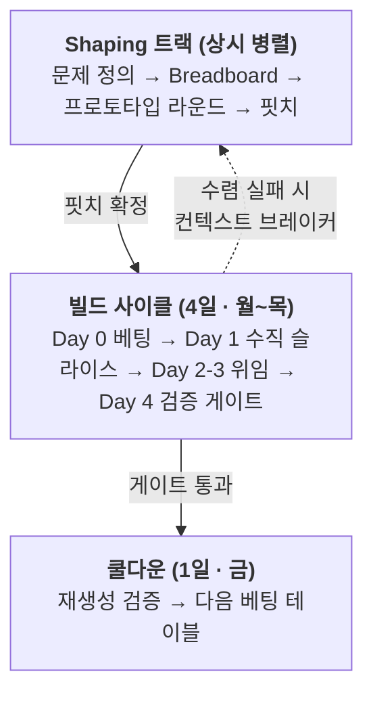

# 주간 사이클 — Shape Up의 바이브 코딩 재해석

Basecamp [Shape Up](https://basecamp.com/shapeup)(Ryan Singer)의 6주 타임박싱 사이클을 VDLC 전제 위에서 재정의한 운영 리듬이다. [매니페스토](/ko/manifesto)의 원칙 5("작게 돌리고, 자주 환류한다")를 팀 단위의 구체적 심박(heartbeat)으로 구현한다.

## 왜 6주를 그대로 쓸 수 없는가

Shape Up이 6주를 선택한 근거는 "의미 있는 것을 완성하기에 충분히 길고, 시작부터 마감의 압박을 느낄 만큼 짧은 기간"이라는 것이었다. 이 계산은 전부 **인간이 코드를 작성한다**는 가정 위에 서 있다.

바이브 코딩은 이 가정을 무너뜨렸다. 구현이 분·시간 단위로 끝나면 사이클 길이를 결정하는 변수는 빌드 시간이 아니라 **shaping(의도 정의)과 검증에 드는 인간의 시간**이다. 병목이 이동했으므로 타임박스도 재설계해야 한다.

Shape Up의 장치들은 세 갈래로 갈라진다.

| 분류 | 해당 장치 | VDLC에서의 운명 |
|---|---|---|
| 살아남음 (강화) | Fixed time·variable scope, Shaping, Appetite, No-Gos | 구현 비용 0 수렴으로 스코프 팽창 속도가 빨라져 타임박스와 shaping이 더 중요해짐 |
| 시간 단위 변경 | 6주 사이클, 2주 쿨다운 | 주 → 일 단위로 압축 (4일 빌드 + 1일 쿨다운, 한 주가 한 심박) |
| 의미 반전 | Circuit breaker, Betting, Hill chart, QA is for the edges, "Shaping은 시니어의 암묵지" | 아래에서 상술 |

## 사이클 구조

주를 일로 치환하되, 심박은 달력 주에 정렬한다. **4 근무일 빌드 + 1일 쿨다운 = 한 주가 한 심박(heartbeat)** 이다. 월요일 아침에 베팅하고 금요일에 쿨다운으로 한 주를 닫는다. 비율은 Shape Up의 3:1에서 4:1로 옮겼다 — 쿨다운의 작업(재생성 검증, 부채 역이전)도 에이전트가 수행하므로 하루면 충분하다.



### Day별 운영 규칙

| Day | 활동 | 완료 조건 |
|---|---|---|
| Day 0 (월 아침) | 베팅 테이블. 핏치 검토, 병렬 베팅 배분, 승자 선정 기준 사전 문서화 | 각 베팅에 이중 예산(인간 주의력 + 컴퓨트) 명시 완료 |
| Day 1 (월) | Get one piece done. 수직 슬라이스 하나를 배포 가능한 상태로 통합 | 실제 환경에서 동작하는 end-to-end 슬라이스 1개 |
| Day 2–3 (화·수) | 스코프 맵 기반 위임. downhill 스코프는 에이전트 완전 위임, uphill 스코프는 인간 판단 | 모든 must-have 스코프 downhill 진입 |
| Day 4 (목) | 검증 게이트. 코딩 금지, 검증 전용 | Done = Deployed 판정 |
| Day 5 (금) | 쿨다운. 재생성 검증 의식, 부채 역이전, ad-hoc 작업, 다음 베팅 테이블 준비 | 컨텍스트 문서만으로 재생성 성공 또는 부채 역이전 완료 |

### 사이클 길이 캘리브레이션

한 주(4일 + 1일)는 기본값이지 하한이 아니다. 사이클은 작업 시간의 추정치가 아니라 **재베팅 리듬**이다. 배포는 사이클 안에서 슬라이스 단위로 수시로 일어나므로(Day 1부터 Done = Deployed), 사이클을 줄여 얻는 것은 더 빠른 배포가 아니라 더 잦은 의사결정이다. 따라서 적정 길이는 세 변수의 함수다.

- **검증 자산 성숙도** — 에이전트 교차 리뷰·자동 평가가 검증을 흡수할수록 인간 게이트의 소요가 줄어 단축 여지가 커진다
- **정보 도착 속도** — 재베팅의 가치는 새 정보(사용자 피드백, 운영 데이터)의 도착 속도에 묶인다. 정보보다 잦은 재베팅은 같은 정보로 회의만 늘린다
- **이해 대역폭** — 환류가 실질이 되려면 사람이 산출물을 이해해야 하고, 이해와 큐레이션의 속도는 컴퓨트로 압축되지 않는다

여기에 베팅 테이블·검증 게이트·재생성 검증이라는 사이클당 고정비가 있어, 지나친 단축은 산출물 대비 오버헤드 비율만 키운다.

| 변형 | 구성 | 적용 대상 |
|---|---|---|
| 기본 | 4일 빌드 + 1일 쿨다운 (한 주) | 성숙도 실천(Practicing) 수준의 팀 |
| 상향 | 8일 빌드 + 2일 쿨다운 (2주) | shaping·합의에 리더십 승인이 필요한 엔터프라이즈 |
| 하향 | 2일 빌드 + 1일 쿨다운 | 검증 자산이 성숙한 자산화(Compounding) 이상 팀, 솔로·소규모 팀 |

하한은 수치로 박제하지 않고 캘리브레이션 절차로 관리한다.

1. 쿨다운마다 shaping 소요 시간과 컨텍스트 브레이커 발동률을 기록한다
2. 브레이커가 2사이클 연속 빈발하면 shaping 시간 부족 신호다 — 한 단계 긴 변형으로 연장한다
3. 쿨다운이 지속적으로 한산하고 검증 게이트가 1회 통과를 유지하면 한 단계 짧은 변형으로 단축한다

## 의미가 반전된 장치들

### Circuit breaker → 컨텍스트 브레이커

Shape Up에서 사이클 내 미완료 프로젝트는 기본적으로 취소된다. VDLC에서는 에이전트가 수렴하지 못하면 구현의 문제가 아니라 **shaping의 실패**다. 기본 동작은 취소가 아니라 **shaping 트랙으로 반송**이다.

발동 조건 (하나라도 충족 시 즉시 발동, Day 4까지 기다리지 않는다):

1. Day 1 종료 시점에 배포 가능한 수직 슬라이스가 없다
2. 컴퓨트 예산을 소진했는데 must-have 스코프가 uphill에 남아 있다
3. 에이전트가 동일 스코프에서 3회 이상 상호 모순되는 접근을 반복한다

발동 시 산출물은 반송 사유서다: 어떤 의도가 불명확했는가, 어떤 Rabbit hole이 미선언이었는가.

### Betting → 병렬 베팅 (옵션 매수)

Shape Up에서 베팅은 한 팀을 6주간 묶는 비싼 결정이었다. VDLC에서 구현이 싸므로 베팅은 옵션 매수다. 불확실성이 높은 핏치에는 **동일 핏치에 2~3개 접근을 병렬로 걸고 승자를 선택**한다.

승자 선정 기준은 Day 0 베팅 시점에 문서화한다. 사후 취향 판정을 금지한다. 기준 예시: 응답 지연 p95, 코드 재생성 성공률, 특정 엣지케이스 통과 여부.

상한을 결정하는 통화는 컴퓨트가 아니라 **인간 주의력**이다. 승자 선정 기준으로 인간이 실제 비교·판정할 수 있는 수가 상한이다(기본값: 병렬 베팅 2~3개, shaping 큐레이션 2~5개). 컴퓨트는 핏치의 appetite 총액 내에서 자유 배분한다.

### Hill chart → 위임 가능성 지도

Shape Up의 hill chart는 진행 상황 보고 도구였다. VDLC에서 동일한 차트가 **인간-에이전트 업무 분배 도구**가 된다.

- **uphill 스코프** = 미지 잔존 = 인간의 판단 필요 구간. 에이전트에게 완전 위임 금지.
- **downhill 스코프** = 의도 확정 = 에이전트 완전 위임 가능 구간.
- 스코프를 downhill로 넘긴다는 것은 "이 스코프의 의도가 컨텍스트 문서에 완결적으로 기술되었다"는 선언이다.

### QA is for the edges → 검증 게이트

Shape Up의 QA는 엣지케이스만 다뤘다 — 인간 구현자가 메인 플로우를 이미 검증했다는 전제였다. VDLC에는 그 전제가 없다. 검증이 명시적 단계로 승격되며 **Day 4 전체가 검증에 배정**된다. Day 4에는 신규 코딩을 금지한다(검증 중 발견된 결함의 수정만 허용).

검증 게이트 체크리스트:

- [ ] 핏치의 Problem이 실제로 해소되었는가 (baseline 대비 비교)
- [ ] No-Gos 위반이 없는가
- [ ] 메인 플로우 인간 검증 완료
- [ ] 엣지케이스 자동 테스트 통과
- [ ] Done = Deployed: 실제 환경 배포 완료

## 프로토타입 주도 Shaping — 의사결정의 바이브 코딩

Shape Up은 shaping을 시니어의 암묵지 영역으로 남겼다. 스케치와 글로 해법을 다듬은 이유는 프로토타입 제작이 비쌌기 때문이다 — 만들어 보는 비용이 논의하는 비용보다 컸다. 바이브 코딩은 이 부등호를 뒤집었다. 구현 비용이 0에 수렴하면 **"만들어 보고 판단"이 "논의해서 판단"보다 싸다**.

AI의 압도적 생산성을 구현 가속에만 쓰는 것은 절반의 활용이다. 나머지 절반은 **의사결정 속도의 최적화**다. 동작하는 프로토타입을 직접 사용해 본 경험은 문서 리뷰가 제공할 수 없는 해상도의 판단 근거를 준다. 따라서 VDLC의 shaping은 문서 활동이 아니라 **프로토타입 라운드를 내장한 실험 활동**이다.

### 두 가지 라운드 패턴

| 패턴 | 방법 | 적합한 불확실성 |
|---|---|---|
| 수렴형 (고속 반복) | 하나의 접근을 만들고, 써 보고, 고치기를 빠르게 반복 | 플로우·문제 공간 — "이 방향이 맞는가" |
| 발산형 (병렬 큐레이션) | 동일 문제에 2~5개 프로토타입을 병렬 생성, 인간이 비교 후 선택 | UI·룩앤필 — 언어화하기 어려운 취향 판단 |

발산형에서 인간의 역할은 제작이 아니라 **큐레이션**이다. 좋은 것을 골라내는 안목이 좋은 것을 만드는 손을 대체한다. 큐레이션 개수의 상한은 컴퓨트가 아니라 인간이 실제 비교·판정할 수 있는 주의력이다.

### 프로토타입의 지위 — throwaway 원칙

프로토타입은 결정을 위한 도구이지 산출물이 아니다.

- 승자를 포함한 모든 프로토타입 코드는 프로덕션으로 승격하지 않는다. 승자가 확정한 의도는 핏치·결정기록에 반영된 뒤 빌드 사이클에서 재생성된다. "의도가 1차 산출물, 코드는 2차 산출물"이라는 핵심 명제의 shaping판 적용이다.
- 단, 폐기 전에 반드시 결정기록과 함께 아카이브한다. 탈락 프로토타입도 버리지 않는다 — "왜 그 길로 가지 않았는가"가 미래의 재논의를 차단한다.

### 결정기록 (Decision Record) 자동 생성

프로토타입 라운드가 끝날 때마다 에이전트가 결정기록을 자동 생성한다. "왜 이 형태로 정해졌는가"는 코드에서 재구성할 수 없는 정보이므로, 기록하지 않으면 shaping 단계에서 컨텍스트 부채가 발생한다. 결정기록은 이를 발생 시점에 차단하는 장치다.

```markdown
# 결정기록: {라운드 제목}

- **라운드 목적**: {어떤 불확실성을 해소하려 했는가}
- **패턴**: 수렴형 | 발산형
- **시도한 접근**: {각 프로토타입 요약 + 스크린샷/링크}
- **승자와 선정 근거**: {무엇이 이겼고 왜}
- **탈락 사유**: {각 탈락안이 왜 버려졌는가}
- **핏치 반영 사항**: {이 결정이 핏치의 어느 부분을 바꿨는가}
```

핏치는 관련 결정기록을 링크한다. 스펙과 프로토타입이 이 링크로 묶여, 장기적으로 "왜 이러한 형태로 정해졌는지"의 맥락이 컨텍스트 자산으로 보존된다.

## 핏치 = 컨텍스트 문서

Shape Up에서 핏치는 베팅 테이블에서 사람을 설득하는 문서였다. VDLC에서 핏치는 **에이전트가 직접 소비하는 실행 가능한 1차 산출물**로 승격된다.

```markdown
# 핏치: {제목}

## 1. Problem
{원시 아이디어가 아니라 좁혀진 문제. baseline: 지금 사용자는 이것 없이 무엇을 하고 있는가}

## 2. Appetite (이중 통화)
- 인간 주의력 예산: shaping {N}시간 + 검증 {N}시간
- 컴퓨트 예산: {토큰/세션 상한}
- 배치 크기: Small(반나절~1일) | Big(빌드 4일 전체)

## 3. Solution
{breadboard 또는 fat marker 수준의 해법. 와이어프레임 금지(과잉 구체), 한 줄 요약 금지(과잉 추상).
UI 스코프 예외: shaping 큐레이션의 승자 프로토타입을 외관 기준점으로 첨부 가능}

## 4. Rabbit Holes
{에이전트가 스스로 판단하지 말고 인간에게 에스컬레이션해야 하는 구간의 명시적 선언}

## 5. No-Gos
{하지 않을 것. 에이전트는 금지를 명시하지 않으면 반드시 한다.
가장 중요한 재료 — 최소 3개 이상 작성}

## 6. (병렬 베팅 시) 승자 선정 기준
{Day 0에 확정. 측정 가능한 기준만 허용}

## 7. 결정기록 링크
{이 핏치의 형태를 결정한 프로토타입 라운드 결정기록 목록}
```

### 의도 해상도

핏치는 **rough / solved / bounded** 세 속성을 만족해야 한다.

- **Rough**: 세부 구현을 확정하지 않아 에이전트에게 해법 탐색 여지를 남긴다
- **Solved**: 핵심 요소와 연결 관계가 정의되어 있어 에이전트가 방향을 잃지 않는다
- **Bounded**: Appetite·No-Gos로 팽창을 차단한다

와이어프레임은 너무 구체적이고(에이전트의 탐색을 죽임), 한 줄 요구사항은 너무 추상적이다(에이전트가 임의로 채움). breadboarding(어포던스와 연결만 정의)이 에이전트 입력으로 가장 적합한 해상도다.

단, 이 원칙은 **구조·로직 영역**에 적용된다. UI·룩앤필은 예외다 — 취향은 에이전트가 탐색할 대상이 아니라 인간이 확정할 대상이므로, 큐레이션으로 확정된 승자 프로토타입을 외관 기준점으로 첨부하는 것은 과잉 구체가 아니다. 구현 방식은 여전히 에이전트의 탐색 영역으로 남는다.

## 쿨다운 = 재생성 검증

Shape Up의 쿨다운은 버그 수정과 ad-hoc 작업의 시간이었다. VDLC 쿨다운의 핵심 의식은 **재생성 검증**이다. 이것이 "의도가 1차 산출물"이라는 명제를 프로세스 수준에서 강제하는 장치다.

1. 이번 사이클의 컨텍스트 문서(핏치 + 사이클 중 갱신분)만을 입력으로 에이전트에게 결과물 재생성을 지시한다
2. 재생성물이 검증 게이트를 통과하는지 확인한다
3. **통과**: 컨텍스트 부채 없음. 사이클 종료.
4. **실패**: 코드에 문서화되지 않은 의도가 숨어 있다는 뜻이다. diff를 분석하여 숨은 의도를 컨텍스트 문서로 **역이전**한다. 역이전 완료 전에는 다음 사이클 베팅을 금지한다.

기술 부채가 아니라 **컨텍스트 부채**(코드에는 있으나 의도 문서에는 없는 결정)의 청산이 쿨다운의 제1과업이다.

## 용어 대응표

| Shape Up | VDLC 주간 사이클 | 변경 요지 |
|---|---|---|
| Cycle (6주) | 빌드 사이클 (4일) | 주→일, 한 주가 한 심박. 상향 변형 8일, 하향 변형 2일 |
| Cool-down (2주) | 쿨다운 (1일) | 재생성 검증이 제1과업 |
| Pitch | 컨텍스트 문서 | 설득용 문서 → 에이전트가 소비하는 1차 산출물 |
| Shaping (시니어의 암묵지) | 프로토타입 주도 shaping | 스케치·글 → 동작하는 프로토타입으로 판단. 큐레이션이 인간 역량 |
| Fat marker sketch | 프로토타입 + 결정기록 | 그림 → 실물. 폐기 전 결정 맥락을 기록으로 보존 |
| Appetite | 이중 통화 Appetite | 인간 주의력 예산 + 컴퓨트 예산 |
| Bet | 병렬 베팅 | 헌신 → 옵션 매수. 승자 기준 사전 문서화 |
| Circuit breaker | 컨텍스트 브레이커 | 취소 → shaping 반송. Day 1 조기 발동 |
| Hill chart | 위임 가능성 지도 | 보고 도구 → 인간-에이전트 업무 분배 도구 |
| Scope hammering | 컨텍스트 해머링 | 코드 삭제가 아니라 의도 문서 수정 후 재생성 |
| QA is for the edges | 검증 게이트 (Day 4) | 보조 활동 → 명시적 단계로 승격 |
| Technical debt | 컨텍스트 부채 | 코드에만 존재하는 미문서화 의도 |
| Done means deployed | Done = Deployed + 재생성 가능 | 배포에 재생성 가능성 조건 추가 |

::: tip
Claude Code로 이 사이클을 운영한다면, 다음 규칙을 CLAUDE.md에 넣어 에이전트가 사이클 규율을 스스로 지키게 한다: 핏치 없는 빌드 금지(핏치가 없으면 초안 작성을 먼저 제안), Rabbit hole 진입 시 자체 판단 대신 에스컬레이션, No-Gos 매 작업 전 확인, uphill 스코프의 "알아서 해달라" 지시에는 미해결 의도를 질문 목록으로 반환, 핏치에 없는 설계 결정은 작업 종료 시 컨텍스트 문서 갱신안으로 제출, 컴퓨트 예산 50% 소진 시 진행률 보고, 프로토타입 라운드 종료 시 결정기록 자동 생성, 프로토타입 코드의 프로덕션 승격 금지.
:::
