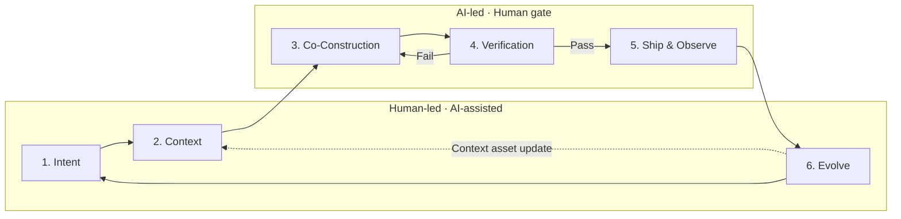

# VDLC: Vibe-Driven Development Lifecycle

**A software development lifecycle redesigned around vibe coding**

---

## 1. Definition

VDLC (Vibe-Driven Development Lifecycle) is a development lifecycle that reconstructs the entire software development process for an era in which AI agents are the ones implementing code. Humans define intent, design context, and verify results; AI agents propose plans, generate code, and check their own work.

The traditional SDLC was built on the assumption that "humans write the code." Its stage divisions—requirements, design, implementation, test, deployment—its time unit of the sprint, and its quality mechanism of code review all start from that assumption. Vibe coding toppled it. VDLC replaces the fallen assumption with a new one and rebuilds the development process from the ground up on top of it.

VDLC's core proposition is a single one: **intent and context are the primary artifacts, and code is a secondary artifact regenerable from them.**

## 2. Background: Why VDLC Now

Since Andrej Karpathy coined the term "vibe coding" in early 2025, the practice of conveying intent in natural language and having AI produce working code has moved beyond experiment and into real work. The cost of writing a single line of code is effectively converging to zero.

The problem is that the rest of the lifecycle stays the same. Implementation finishes in minutes, yet requirements still take several meetings, and reviews still wait days for a human's hands. The bottleneck has moved from "writing code" to "deciding what to build" and "confirming whether what was built can be trusted." If you leave the existing SDLC in place and slot AI only into the implementation stage, four problems recur.

First, **speed imbalance.** If only implementation gets faster while the stages before and after stay the same, total lead time barely shrinks, and the organization runs into the question, "We adopted AI, so why aren't we any faster?" Second, **quality risk.** Development that enjoys only generation speed without a verification system mass-produces code that dazzles in a demo but is impossible to maintain in production—so-called AI slop. Third, **knowledge evaporation.** Decisions and domain knowledge scattered through prompts and conversations vanish when the session ends, and the next task starts from bare ground again. Fourth, **capability erosion.** When approving code you don't understand becomes routine, the codebase grows fast while the number of people who can judge that code steadily shrinks. This gap accumulates as cognitive debt, until at some point the organization can no longer explain the very system it owns.

VDLC tackles these four problems head-on. It places the bottleneck stages (intent definition, verification) at the center of the lifecycle, accumulates evaporating knowledge as context assets, and builds a structure in which a person's understanding grows along the way.

## 3. Six Principles

**Principle 1 — Intent as Source.** The starting point and the original of development is intent written in natural language, not code written in a programming language. A well-written intent document is not a write-once, throw-away requirements spec but an executable spec fed to agents again and again. Narrative documents like Amazon's 6-pager and PR-FAQ are a good form because they carry context, rationale, and trade-offs as narrative, reducing the agent's need to guess at what lies between the lines.

**Principle 2 — Humans Judge, AI Executes.** What to build, how far to allow it, and whether to trust the result are the human's job. How to implement it and how to handle repetitive work are the agent's job. When this boundary breaks, both sides fail. Delegate judgment too, and you lose control; keep humans holding execution too, and you lose speed.

**Principle 3 — Verification Sets the Pace.** Generation is no longer the bottleneck. Total lead time is decided not by "how fast you build" but by "how fast you can trust what was built." Investing in verification assets—tests, evaluation criteria, review systems—is therefore investing in speed.

**Principle 4 — Context as Asset.** Project rules (CLAUDE.md), reusable skills, domain wikis, and coding conventions are not incidental documents but core organizational assets. With the same model, output quality diverges by the quality of the context. VDLC designs a compounding structure in which these assets thicken with every cycle, and the thicker they get, the faster the next cycle runs.

**Principle 5 — Run Small Cycles, Feed Back Often.** The unit of one cycle is hours and days, not week-long sprints. Run intent–build–verify in small units, and fold what you learned in each cycle back into context immediately.

**Principle 6 — Understanding as Ownership.** The moment you approve code an agent made, responsibility for that code becomes yours. Output approved without understanding piles up as cognitive debt and, like technical debt, compounds. With every cycle, it isn't enough for the context assets alone to thicken—a person's understanding must grow too. So VDLC treats learning not as an individual's choice but as an activity built into the lifecycle.

## 4. The Lifecycle: Six Stages

The six stages differ in who drives them. Intent, Context, and Evolve (stages 1, 2, 6) are led by humans and assisted by AI. Co-Construction, Verification, and Ship & Observe (stages 3, 4, 5) are led by AI, but humans guard each stage's gate—plan approval, final review, deploy approval. Handing over the lead is not the same as handing over judgment. The boundary of Principle 2 is implemented in the lifecycle precisely through these gates.

### Stage 1 — Intent

*Driver: Human · Support: AI*

People agree on what to build and why, and turn it into a document. The artifact is a narrative-form intent document. First picture the finished shape with a PR-FAQ, then describe the background, constraints, and trade-offs in 6-pager form, and state verifiable success criteria. The quality of this stage sets the ceiling for every stage that follows. Vague intent invites the agent to guess, and guesses invite rework.

→ [Stage 1 Playbook](/guide/intent)

### Stage 2 — Context

*Driver: Human · Support: AI*

Prepare the knowledge and rules the agent will reference. Project rules, architecture decision records, coding conventions, domain glossaries, and reusable skills all belong here. For a new project, set up a minimal skeleton; for an existing project, inspect and refresh the assets accumulated in prior cycles.

→ [Stage 2 Playbook](/guide/context)

### Stage 3 — Co-Construction

*Driver: AI · Gate: Human (plan approval)*

The agent proposes a plan, the human approves it, and the agent implements. The heart of it is the "plan approval" gate. Instead of reviewing code line by line, controlling direction at the plan level lets you keep control while fully enjoying generation speed. Work is split into small, independently verifiable units, and multiple agents can be orchestrated in parallel per unit. So the approval gate doesn't become a rote click, summarize the plan in your own words before approving and check it back with the agent. If the summary is off, that is a problem of understanding before it is a problem of the plan—and the rule is not to approve a plan you don't understand.

→ [Stage 3 Playbook](/guide/build)

### Stage 4 — Verification

*Driver: AI · Gate: Human (final review)*

Confirm whether what was built can be trusted. Automated tests and static analysis are the first line of defense, a separate agent's cross-review is the second, and human review is the final gate. Rather than applying the same intensity to every artifact, scale verification intensity in proportion to risk. Strengthen human review for areas where failure is costly—payments, authentication, personal data—and let internal tools or prototypes pass lightly on automated checks. Problems found in verification aren't closed out with a code fix alone; trace them back to defects in the intent document or context and fix those too. Verification covers not only the output but the approver's understanding. For high-risk changes, put "can the approver explain this code" into the pass criteria. Explain-back—explaining what you understood to the agent and having it confirmed—and code walkthroughs, tracing the change points together with the agent, are effective tools.

→ [Stage 4 Playbook](/guide/verify)

### Stage 5 — Ship & Observe

*Driver: AI · Gate: Human (deploy approval)*

Ship the verified output and observe operational data. A CI/CD pipeline and observability tools are preconditions for VDLC to work. Issues found in operation are organized into reproducible context—complete with logs, reproduction steps, and expected behavior—and turned into input for the next cycle.

→ [Stage 5 Playbook](/guide/ship)

### Stage 6 — Evolve

*Driver: Human · Support: AI*

Fold what the cycle taught into the assets. Repeated instructions become project rules, mistake patterns caught in verification become review-checklist items, and newly organized domain knowledge goes into the wiki. Skip this stage and VDLC is merely fast coding. Only with feedback does the learning loop complete, in which the organization gets smarter with every cycle. Feedback covers more than context assets. Revisit the patterns and techniques you met for the first time this cycle, put them into your own words, and if there are points you passed over without understanding, repay them here. Only when the organization's assets and the individual's understanding grow together does judgment in the next cycle get faster.

→ [Stage 6 Playbook](/guide/evolve)

## 5. Redefining Roles

In VDLC the developer becomes not a code writer but a fusion of three roles: the **intent designer** who forges intent into a clear document, the **orchestrator** who distributes work across multiple agents and coordinates progress, and the **verifier** who judges whether to trust the result. The value of typing proficiency drops, while the value of problem definition, a sense for system design, and review judgment rises. And the foundation under all three roles is learning. A developer who doesn't refresh their understanding with every cycle sees the verifier role collapse first.

The scope for non-developer roles widens too. Planners and domain experts become co-authors of the intent document and can carry out prototype-level implementation themselves. That said, final responsibility for stage 4 verification remains with engineers who can judge production quality.

## 6. Redefining Artifacts

| Aspect | Traditional SDLC | VDLC |
|---|---|---|
| Primary artifact | Code | Intent documents, context assets, verification assets |
| Status of code | A hand-crafted original | A regenerable secondary artifact |
| Status of documents | A record trailing the code (often neglected) | A spec preceding the code (input for the agent) |
| What accumulates | The codebase | Codebase + context assets + evaluation criteria + human understanding |

The practical meaning of this shift is clear. Documentation turns from a cost that delays development into an investment that raises the quality of the next generation.

## 7. Relationship to Existing Methodologies

VDLC does not negate existing methodologies; it stands on top of them. It inherits **Agile's** spirit of iteration and feedback intact, but compresses the iteration cycle from week-long sprints into hour- and day-scale cycles. The CI/CD and observability infrastructure that **DevOps** built is the foundation for stages 4 and 5 to work. **TDD's** thinking of "set the verification criteria first" expands into Principle 3.

VDLC shares its problem awareness with AWS's **AI-DLC.** Where AI-DLC offers an organization-level blueprint of Inception–Construction–Operations and mob-centered collaboration rituals, VDLC puts vibe-coding practice at the center and concretizes the execution loop that individuals and teams run every day, along with the structure for turning context into assets. The two are not competitors but complementary: an organizational-perspective frame (AI-DLC) and a practice-perspective cycle (VDLC).

## 8. Anti-patterns

**Vibes without verification.** Drunk on generation speed, you skip stage 4. Early on it looks like fast progress, but as code you don't understand piles up, at some point a single fix breeds three regression bugs. The classic path that reaches the demo but never reaches production.

**Prompts without context.** You start every session from bare ground. You repeat the same instructions, style and structure diverge from session to session, and consistency across teammates' output falls apart. A symptom of an organization where Evolve (stage 6) isn't working.

**The human bottleneck.** Generation runs in minutes while the review system stays as it was. Agent output piles up in the review queue, and the benefit of AI adoption is eaten by wait time. A signal that the verification system needs redesign—risk-based verification intensity and agent cross-review among them.

**The full-automation illusion.** You delegate even judgment to the agent. Remove the human gate at judgment points like requirements interpretation, architecture choice, and deploy approval, and you go far in the wrong direction fast. The boundary of Principle 2 must hold even as automation levels rise.

**Approval without understanding.** You just press the approve button at every gate. For now the cycle runs smoothly, but as cognitive debt accumulates, review judgment itself erodes, and at some point Principle 2's "humans judge" rings hollow. A gate guarded by someone who cannot judge is no gate at all.

## 9. Adoption Path

Organizational adoption proceeds in four steps: pilot → context asset-building → team-level rollout → organizational standardization. First experience all six stages on an internal tool or a small new project where failure is cheap, organize the resulting rules and knowledge into reusable context assets, roll out to the team level through a verification system equipped with test criteria, review rules, and risk grades, and settle it as an organizational standard using metrics like cycle lead time, rework rate, and context asset growth.

The goal, the work, and the completion signal for each step are covered in detail in the [Adoption Roadmap](/adoption/roadmap).

## Closing

Vibe coding is a change of assumption, not a change of tool. VDLC is one answer to what to build in the place left empty when the assumption "humans write the code" disappears. An organization that makes intent the original, makes speed out of verification, and compounds context grows a little faster than a competitor on the same model with every cycle. The accumulation of that gap is exactly what development competitiveness looks like in the AI era.
