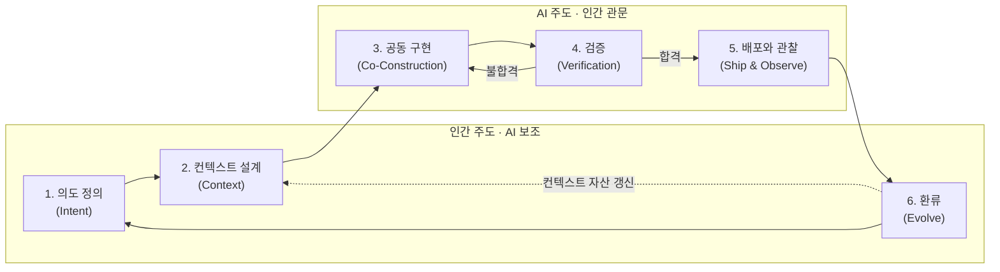

# VDLC

## Vibe-Driven Development Lifecycle

바이브코딩을 전제로 재설계한 소프트웨어 개발 생명주기

---

# 바이브코딩의 등장

- 자연어로 의도를 전달하면 AI가 동작하는 코드를 생성
- 2025년 초 명명 이후, 실험을 넘어 실무로 진입
- 코드 한 줄 작성 비용, 사실상 0으로 수렴
- 문제는 생명주기의 나머지 구간이 그대로라는 것

---

# 병목의 이동

- 구현은 분 단위로 끝나지만 요구 정의는 여전히 회의 몇 번
- 리뷰는 여전히 사람 손을 며칠씩 기다림
- 병목: "코드를 쓰는 일" → "무엇을 만들지 정하는 일" + "믿을 수 있는지 확인하는 일"
- 구현 단계에만 AI를 끼워 넣으면 문제가 반복됨

---

# 기존 SDLC에 AI만 얹으면

- **속도 불균형** — 구현만 빨라져 전체 리드타임은 거의 그대로
- **품질 리스크** — 검증 없는 생성 속도가 AI 슬롭을 양산
- **지식의 휘발** — 프롬프트 속 의사결정, 세션 종료와 함께 소멸
- **역량 침식** — 이해 없는 승인이 인지부채(cognitive debt)로 누적, 판단할 수 있는 사람이 감소

---

# VDLC란

- AI 에이전트가 코드 구현의 주체가 되는 시대의 개발 생명주기
- 인간 — 의도 정의·컨텍스트 설계·결과 검증
- AI 에이전트 — 계획 제안·코드 생성·자가 점검
- 핵심 명제: **의도와 컨텍스트가 1차 산출물, 코드는 재생성 가능한 2차 산출물**

---

# 원칙 1 — 의도가 소스다

### Intent as Source

- 자연어로 쓴 의도가 개발의 출발점이자 원본
- 한 번 쓰고 버리는 명세가 아니라 반복 투입되는 실행 가능한 스펙
- 6-pager·PR-FAQ 같은 내러티브 형식 — 맥락과 트레이드오프를 서사로 전달

---

# 원칙 2 — 인간은 판단하고, AI는 실행한다

- 무엇을 만들지·어디까지 허용할지·결과를 믿을지 — 인간의 몫
- 어떻게 구현할지·반복 작업 처리 — 에이전트의 몫
- 경계가 무너지면 양쪽 모두 사고 — 판단 위임 시 통제 상실, 실행 집착 시 속도 상실

---

# 원칙 3 — 속도는 검증이 결정한다

### Verification Sets the Pace

- 생성은 더 이상 병목이 아니다
- 전체 리드타임을 결정하는 것은 "얼마나 빨리 믿을 수 있느냐"
- 테스트·평가 기준·리뷰 체계에 대한 투자가 곧 속도에 대한 투자

---

# 원칙 4 — 컨텍스트는 자산이다

### Context as Asset

- CLAUDE.md, 재사용 스킬, 도메인 위키, 코딩 컨벤션 — 조직의 핵심 자산
- 같은 모델을 써도 컨텍스트 품질에 따라 산출물 품질이 갈림
- 사이클을 돌 때마다 자산이 두꺼워지는 복리 구조

---

# 원칙 5 — 작게 돌리고, 자주 환류한다

- 사이클 단위는 스프린트가 아니라 시간과 일
- 작은 단위로 의도–구현–검증을 반복
- 각 사이클에서 배운 것을 즉시 컨텍스트에 반영

---

# 원칙 6 — 이해가 소유다

### Understanding as Ownership

- 에이전트의 코드를 승인하는 순간, 책임은 승인한 사람의 것
- 이해 없는 승인은 인지부채 — 기술부채처럼 복리로 누적
- 컨텍스트 자산과 함께 사람의 이해도 자라야 함
- 학습은 개인의 선택이 아니라 라이프사이클에 내장된 활동

---
layout: section
---

# 라이프사이클

---

# 여섯 단계

주도권은 넘겨도 관문—계획 승인·최종 리뷰·배포 승인—은 인간이 지킨다

---

# 1단계 — 의도 정의 (Intent)

주도: 인간 · 보조: AI

- 문제·기회를 한 문단으로 서술, 데이터나 사례로 뒷받침
- PR-FAQ로 완성된 모습을 역산, 6-pager로 배경·트레이드오프 서술
- 검증 가능한 성공 기준 명시 ("~하면 성공")
- 흔한 실수: 기능 나열식 요구사항 — 왜 필요한지 없이 화면·버튼만 나열

---

# 2단계 — 컨텍스트 설계 (Context)

주도: 인간 · 보조: AI

- CLAUDE.md에 코딩 컨벤션·금지 사항·명령어를 최소 골격으로 작성
- ADR로 아키텍처 결정과 근거 기록, 도메인 용어집 정리
- 기존 프로젝트는 신규 작성보다 낡은 자산 점검·갱신이 중심
- 흔한 실수: 규칙 파일에 모든 것을 넣어 컨텍스트 비대화

---

# 3단계 — 공동 구현 (Co-Construction)

주도: AI · 관문: 인간(계획 승인)

- 작업을 독립적으로 검증 가능한 단위로 분해
- 에이전트가 계획 제안 → 인간이 승인(관문) → 에이전트가 구현
- 승인 전 계획을 자기 언어로 요약해 되묻기 — 이해 못 한 계획은 승인하지 않음
- 흔한 실수: 계획 없이 바로 구현을 지시

---

# 4단계 — 검증 (Verification)

주도: AI · 관문: 인간(최종 리뷰)

- 1차 방어선: 자동 테스트·정적 분석
- 리스크 등급에 비례해 교차 리뷰·인간 리뷰 강도 조절
- 검증 대상에는 승인자의 이해도 포함 — 고리스크 변경은 "설명할 수 있는가"가 통과 기준
- 흔한 실수: 모든 산출물에 같은 강도의 검증을 적용

---

# 5단계 — 배포와 관찰 (Ship & Observe)

주도: AI · 관문: 인간(배포 승인)

- 검증 통과 산출물은 별도 승인 없이 자동 배포
- 로그·에러율·지연 시간 등 운영 데이터를 상시 관찰
- 이슈는 로그·재현 절차·기대 동작을 갖춰 다음 사이클 입력으로
- 흔한 실수: 이슈를 대화로만 전달 — 재현 가능한 컨텍스트 부재

---

# 6단계 — 환류 (Evolve)

주도: 인간 · 보조: AI

- 반복된 지시는 프로젝트 규칙으로, 실수 패턴은 리뷰 체크리스트로
- 새로 밝혀진 도메인 지식은 위키로 정리
- 개인의 이해도 환류 대상 — 이해 못 한 채 넘어간 지점은 여기서 상환
- 흔한 실수: 환류 생략 — 배운 것을 자산에 반영하지 않고 다음 사이클로

---

# 역할의 재정의

- 개발자 = 의도 설계자 + 오케스트레이터 + 검증자의 결합체
- 타이핑 숙련도의 가치는 줄고, 문제 정의력·설계 감각·리뷰 안목의 가치는 증가
- 세 역할의 토대는 학습 — 이해를 갱신하지 않으면 검증자 역할부터 붕괴
- 비개발 직군도 의도 문서 작성과 프로토타입 구현에 참여
- 검증(4단계)의 최종 책임은 프로덕션 품질을 판단할 수 있는 엔지니어에게

---

# 산출물의 재정의

| 구분 | 전통 SDLC | VDLC |
|---|---|---|
| 1차 산출물 | 코드 | 의도 문서, 컨텍스트 자산, 검증 자산 |
| 코드의 지위 | 수작업으로 만든 원본 | 재생성 가능한 2차 산출물 |
| 문서의 지위 | 코드를 뒤따르는 기록(자주 방치됨) | 코드에 앞서는 스펙(에이전트의 입력) |
| 축적되는 것 | 코드베이스 | 코드베이스 + 컨텍스트 자산 + 평가 기준 + 사람의 이해 |

---

# 기존 방법론과의 관계

- **애자일** — 반복·피드백 정신 계승, 주기는 스프린트에서 시간·일 단위로 압축
- **DevOps** — CI/CD·관측 인프라, 4·5단계가 작동하는 토대
- **TDD** — "검증 기준을 먼저 세운다"는 사고가 원칙 3으로 확장
- **AI-DLC**(AWS) — 조직 관점 프레임과 실무 관점 사이클로 상호 보완

---

# 안티패턴 — 검증과 컨텍스트

- **검증 없는 바이브** — 4단계를 건너뛰면 이해 못 한 코드가 쌓여 회귀 버그로 귀결
- **컨텍스트 없는 프롬프트** — 매 세션을 맨바닥에서 시작, 팀원 간 산출물 일관성 붕괴

---

# 안티패턴 — 병목, 자동화, 승인

- **병목이 된 인간** — 생성은 분 단위인데 리뷰 체계는 예전 그대로, 대기열 적체
- **전 구간 자동화 환상** — 판단까지 에이전트에 위임하면 빠르게 잘못된 방향으로
- **이해 없는 승인** — 승인 버튼만 누르면 인지부채가 리뷰 안목을 침식, 판단할 수 없는 사람이 지키는 관문은 관문이 아님

---

# 성숙도 모델 — 4레벨

| 레벨 | 이름 | 특징 |
|---|---|---|
| L1 | 탐색(Exploring) | 개인이 바이브코딩 실험 중, 프로세스 없음 |
| L2 | 실천(Practicing) | 개인/소수가 VDLC 사이클을 돌림 |
| L3 | 자산화(Compounding) | 팀 단위 컨텍스트 자산 축적·재사용 |
| L4 | 표준화(Systematizing) | 조직 표준 정착, 지표로 관리 |

---

# 측정 지표 — 4종

| 지표 | 정의 |
|---|---|
| 사이클 리드타임 | 의도 정의 시작부터 배포까지 걸린 시간 |
| 재작업률 | 완료 후 결함·재구현으로 다시 손댄 비율 |
| 검증 통과율 (1회 통과 비율) | 검증에 처음 제출해 수정 없이 통과한 비율 |
| 컨텍스트 자산 증가량 | 재사용 가능한 자산의 증가·재사용 현황 |

---

# 도입 로드맵 — 네 걸음

- **파일럿** — 실패 비용 낮은 영역에서 여섯 단계 전 구간 완주
- **컨텍스트 자산화** — 반복 설명·실수 패턴을 규칙·체크리스트로 정리
- **팀 확산** — 개인 자산을 팀 공용으로, 검증 체계를 팀 표준으로
- **조직 표준** — 지표 4종을 정기 수집, 온보딩에 자산 재사용을 기본화

---

# 다시, 핵심 명제

**의도와 컨텍스트가 1차 산출물이고,**
**코드는 그로부터 재생성 가능한 2차 산출물이다.**

검증으로 속도를 만들고, 컨텍스트를 복리로 쌓는 조직이
사이클을 돌 때마다 조금씩 더 빨라진다.

---

# 더 알아보기

- 전문(매니페스토), 단계별 플레이북, 도입 가이드
- 템플릿 — 의도 문서, PR-FAQ, 리스크 매트릭스, 리뷰 체크리스트
- **https://vdlc.roboco.io**

---

# 감사합니다

https://vdlc.roboco.io
