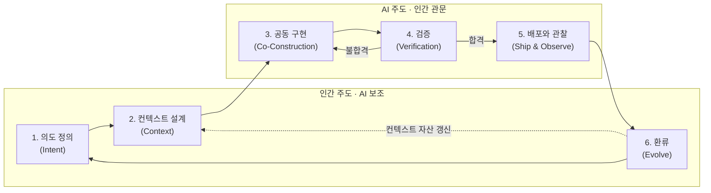

# VDLC 학습·인지부채 통합 구현 계획

> **For agentic workers:** REQUIRED SUB-SKILL: Use superpowers:subagent-driven-development (recommended) or superpowers:executing-plans to implement this plan task-by-task. Steps use checkbox (`- [ ]`) syntax for tracking.

**Goal:** `vdlc.md`에 사람의 학습·인지부채 해소(원칙 6 + 횡단 장치)와 인간 주도/AI 주도 영역 구분을 통합한다.

**Architecture:** 단일 마크다운 문서의 8개 지점 수정. 라이프사이클 6단계 골격은 유지하고, 개념 층(배경·원칙) → 구조 층(라이프사이클 주도권·단계별 장치) → 마무리 층(안티패턴·표·역할) 순으로 3개 태스크로 나눈다. 코드가 아니므로 테스트 대신 grep 기반 일관성 검증을 쓴다.

**Tech Stack:** Markdown, mermaid (flowchart + subgraph)

## Global Constraints

- 스펙: `specs/2026-07-24-vdlc-learning-cognitive-debt-design.md`
- 수정 대상은 `vdlc.md` 하나뿐이다. docs 사이트·슬라이드는 비범위.
- 문서의 내러티브 톤 유지: 단정적 서술, 불릿 최소화, 원칙명은 "한국어 (English)" 병기.
- 라이프사이클은 6단계를 유지한다(단계 추가 금지).
- 연구 문헌 인용 금지.
- 개수 표현("세 가지 문제", "다섯 가지 원칙" 등)은 수정 후 전부 일관되어야 한다.

---

### Task 1: 개념 층 — 배경 네 번째 문제 + 원칙 6

**Files:**
- Modify: `vdlc.md` (2장 배경, 3장 원칙)

**Interfaces:**
- Produces: "인지부채(cognitive debt)" 용어를 2장에서 최초 도입 → 이후 태스크는 괄호 병기 없이 "인지부채"로만 표기한다. 원칙 번호 "원칙 6"은 Task 3의 안티패턴에서 참조하지 않지만, "원칙 2" 참조는 유지된다.

- [ ] **Step 1: 2장에 넷째 문제 추가**

기존 문단(21행) 끝의 `셋째, **지식의 휘발**이다. … 다시 맨바닥에서 시작한다.` 뒤에 같은 문단 안에 이어서 추가:

```markdown
넷째, **역량 침식**이다. 이해하지 못한 코드를 승인하는 일이 반복되면, 코드베이스는 빠르게 자라는데 그 코드를 판단할 수 있는 사람은 점점 줄어든다. 이 격차는 인지부채(cognitive debt)로 쌓여, 어느 순간 조직은 자신이 소유한 시스템을 설명하지 못하게 된다.
```

- [ ] **Step 2: 2장 마지막 문단의 개수·범위 갱신**

기존:
```markdown
VDLC는 이 세 문제를 정면으로 다룬다. 병목이 된 구간(의도 정의, 검증)을 생명주기의 중심에 두고, 휘발되던 지식을 컨텍스트 자산으로 축적하는 구조를 만든다.
```

변경:
```markdown
VDLC는 이 네 문제를 정면으로 다룬다. 병목이 된 구간(의도 정의, 검증)을 생명주기의 중심에 두고, 휘발되던 지식을 컨텍스트 자산으로 축적하며, 사람의 이해가 함께 자라는 구조를 만든다.
```

- [ ] **Step 3: 3장 제목 변경 및 원칙 6 추가**

제목 변경: `## 3. 다섯 가지 원칙` → `## 3. 여섯 가지 원칙`

원칙 5 문단 뒤에 추가:

```markdown
**원칙 6 — 이해가 소유다 (Understanding as Ownership).** 에이전트가 만든 코드를 승인하는 순간, 그 코드의 책임은 승인한 사람의 것이 된다. 이해하지 못한 채 승인한 산출물은 인지부채로 쌓이고, 기술부채처럼 복리로 불어난다. 사이클을 돌 때마다 컨텍스트 자산만 두꺼워져서는 안 되고, 사람의 이해도 함께 자라야 한다. 그래서 VDLC는 학습을 개인의 선택이 아니라 라이프사이클에 내장된 활동으로 다룬다.
```

- [ ] **Step 4: 검증**

Run: `grep -n "세 문제\|다섯 가지\|네 문제\|여섯 가지\|인지부채" vdlc.md`
Expected: "세 문제"·"다섯 가지" 0건, "네 문제" 1건, "여섯 가지" 1건, "인지부채" 2건(2장 1 + 원칙 6 1)

- [ ] **Step 5: Commit**

```bash
git add vdlc.md
git commit -m "docs: 배경에 역량 침식 문제, 원칙 6 '이해가 소유다' 추가"
```

---

### Task 2: 구조 층 — 라이프사이클 주도권 구분 + 단계별 이해·학습 장치

**Files:**
- Modify: `vdlc.md` (4장 라이프사이클)

**Interfaces:**
- Consumes: Task 1이 도입한 "인지부채" 용어(괄호 병기 없이 사용).
- Produces: "주도와 관문" 프레임, 각 단계의 `*주도: … *` 표기 — Task 3의 안티패턴이 이 관문 개념을 참조한다.

- [ ] **Step 1: mermaid 다이어그램을 subgraph 구조로 교체**

기존 다이어그램 전체를 다음으로 교체:

````markdown

````

- [ ] **Step 2: 다이어그램 바로 아래에 "주도와 관문" 도입 문단 추가**

```markdown
여섯 단계는 주도자가 다르다. 의도 정의, 컨텍스트 설계, 환류(1·2·6단계)는 인간이 주도하고 AI가 보조한다. 공동 구현, 검증, 배포와 관찰(3·4·5단계)은 AI가 주도하되, 각 단계의 관문—계획 승인, 최종 리뷰, 배포 승인—은 인간이 지킨다. 주도권을 넘기는 것과 판단을 넘기는 것은 다르다. 원칙 2의 경계는 바로 이 관문들로 라이프사이클에 구현된다.
```

- [ ] **Step 3: 각 단계 제목 아래에 주도자 표기 추가**

각 `### N단계 — …` 제목 바로 다음 줄에 이탤릭 한 줄 추가:

- 1단계: `*주도: 인간 · 보조: AI*`
- 2단계: `*주도: 인간 · 보조: AI*`
- 3단계: `*주도: AI · 관문: 인간(계획 승인)*`
- 4단계: `*주도: AI · 관문: 인간(최종 리뷰)*`
- 5단계: `*주도: AI · 관문: 인간(배포 승인)*`
- 6단계: `*주도: 인간 · 보조: AI*`

- [ ] **Step 4: 3단계 본문 끝에 설명 되물기 추가**

3단계 문단 끝(`…병렬로 오케스트레이션할 수 있다.` 뒤)에 이어서:

```markdown
승인 관문이 형식적인 클릭이 되지 않으려면, 승인 전에 계획을 자기 언어로 요약해 에이전트에게 되물어 확인한다. 요약이 어긋난다면 그것은 계획의 문제이기 이전에 이해의 문제이고, 이해하지 못한 계획은 승인하지 않는 것이 원칙이다.
```

- [ ] **Step 5: 4단계 본문 끝에 이해 검증 추가**

4단계 문단 끝(`…결함까지 추적해 고친다.` 뒤)에 이어서:

```markdown
검증의 대상에는 산출물만이 아니라 승인자의 이해도 포함된다. 리스크가 높은 변경은 "승인자가 이 코드를 설명할 수 있는가"를 통과 기준에 넣는다. 자신이 이해한 바를 에이전트에게 설명하고 맞는지 확인받는 설명 되물기, 에이전트와 함께 변경 지점을 짚어가는 코드 워크스루가 유효한 도구다.
```

- [ ] **Step 6: 6단계 본문 끝에 개인 학습 추가**

6단계 문단에서 `…학습 루프가 완성된다.` 앞 문장 확인 후, 문단 끝에 이어서:

```markdown
환류의 대상은 컨텍스트 자산만이 아니다. 사이클에서 처음 만난 패턴과 기술을 되짚어 자기 언어로 정리하고, 이해하지 못한 채 넘어간 지점이 있다면 여기서 상환한다. 조직의 자산과 개인의 이해가 함께 자라야 다음 사이클의 판단이 빨라진다.
```

- [ ] **Step 7: 검증**

Run: `grep -c "주도:" vdlc.md && grep -n "subgraph" vdlc.md | head -2`
Expected: "주도:" 6건, subgraph 2건. 이어서 mermaid 문법 확인: 다이어그램 블록을 눈으로 재확인(화살표가 subgraph 밖 전역 레벨에 있는지).

- [ ] **Step 8: Commit**

```bash
git add vdlc.md
git commit -m "docs: 라이프사이클에 주도·관문 구분과 이해 검증·학습 장치 추가"
```

---

### Task 3: 마무리 층 — 안티패턴 + 산출물 표 + 역할 재정의

**Files:**
- Modify: `vdlc.md` (5장 역할, 6장 산출물, 8장 안티패턴)

**Interfaces:**
- Consumes: Task 1의 "인지부채" 용어, Task 2의 관문 개념("계획 승인" 등).

- [ ] **Step 1: 8장에 안티패턴 "이해 없는 승인" 추가**

`**전 구간 자동화 환상.**` 문단 뒤에 추가:

```markdown
**이해 없는 승인.** 관문마다 승인 버튼만 누르는 경우다. 당장은 사이클이 매끄럽게 돌지만, 인지부채가 쌓이면서 리뷰 안목 자체가 침식되고, 어느 순간 "인간은 판단한다"는 원칙 2가 공허해진다. 판단할 수 없는 사람이 지키는 관문은 관문이 아니다.
```

- [ ] **Step 2: 6장 산출물 표 갱신**

기존:
```markdown
| 축적되는 것 | 코드베이스 | 코드베이스 + 컨텍스트 자산 + 평가 기준 |
```

변경:
```markdown
| 축적되는 것 | 코드베이스 | 코드베이스 + 컨텍스트 자산 + 평가 기준 + 사람의 이해 |
```

- [ ] **Step 3: 5장 역할 재정의에 학습 책임 추가**

첫 문단 끝(`…리뷰 안목의 가치가 커진다.` 뒤)에 이어서:

```markdown
그리고 세 역할을 지탱하는 토대는 학습이다. 사이클을 돌 때마다 자신의 이해를 갱신하지 않는 개발자는 검증자 역할부터 무너진다.
```

- [ ] **Step 4: 전체 일관성 검증**

Run: `grep -n "세 가지 문제\|다섯 가지 원칙\|cognitive debt" vdlc.md`
Expected: 앞 두 패턴 0건, "cognitive debt" 정확히 1건(2장 최초 도입뿐 — 원칙 6은 "Understanding as Ownership"만 병기). 2건 이상이면 괄호 병기가 중복된 것이니 최초 도입만 남기고 제거한다.

Run: `grep -c "인지부채" vdlc.md`
Expected: 3건 (2장, 원칙 6, 안티패턴)

- [ ] **Step 5: 최종 통독**

vdlc.md 전체를 읽고 톤 일관성(단정적 서술, 신규 문장이 기존 문체와 이질감 없는지)을 확인한다. 이질적인 문장이 있으면 다듬는다.

- [ ] **Step 6: Commit & Push**

```bash
git add vdlc.md
git commit -m "docs: 안티패턴 '이해 없는 승인', 산출물·역할에 학습 반영"
git push origin main
```
