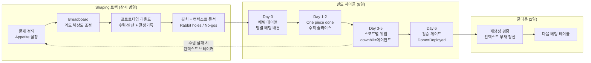

# VDLC 6일 사이클 — Shape Up의 바이브 코딩 재해석

> **문서 목적**: 이 문서는 Basecamp Shape Up(Ryan Singer)의 6주 타임박싱 사이클을
> VDLC(Vibe-Driven Development Lifecycle) 전제 위에서 재정의한 방법론 정의서다.
> Claude Code를 포함한 AI 에이전트가 이 문서를 컨텍스트로 받아
> 사이클 운영, 핏치 작성, 스코프 관리, 검증 게이트 수행을 보조할 수 있도록 작성되었다.
>
> **원전**: https://basecamp.com/shapeup
> **전제 프레임워크**: VDLC — 의도와 컨텍스트가 1차 산출물이고, 코드는 그로부터 재생성 가능한 2차 산출물이다.

---

## 1. 왜 6주를 그대로 쓸 수 없는가

Shape Up이 6주를 선택한 근거는 "의미 있는 것을 완성하기에 충분히 길고,
시작부터 마감의 압박(time horizon)을 느낄 만큼 짧은 기간"이라는 것이었다.
이 계산은 전부 **인간이 코드를 작성한다**는 가정 위에 서 있다.

바이브 코딩은 이 가정을 무너뜨렸다. 구현이 분·시간 단위로 끝나면
사이클 길이를 결정하는 변수는 빌드 시간이 아니라
**shaping(의도 정의)과 검증에 드는 인간의 시간**이다.
병목이 이동했으므로 타임박스도 재설계해야 한다.

Shape Up의 장치들은 세 갈래로 갈라진다.

| 분류 | 해당 장치 | VDLC에서의 운명 |
|---|---|---|
| 살아남음 (강화) | Fixed time·variable scope, Shaping(rough/solved/bounded), Appetite, No-Gos | 구현 비용 0 수렴으로 스코프 팽창 속도가 빨라져 타임박스와 shaping이 더 중요해짐 |
| 시간 단위 변경 | 6주 사이클, 2주 쿨다운, Small/Big batch | 주 → 일 단위로 압축 (6일 빌드 + 2일 쿨다운) |
| 의미 반전 | Circuit breaker, Betting, Hill chart, QA is for the edges, "Shaping은 시니어의 암묵지" | 아래 3장·4장에서 상술 |

---

## 2. VDLC 6일 사이클 구조

6주:2주 = 3:1 비율을 유지하며 주를 일로 치환한다.
**6 근무일 빌드 + 2일 쿨다운** = 약 1.5주가 한 심박(heartbeat)이다.



### Day별 운영 규칙

| Day | 활동 | 완료 조건 |
|---|---|---|
| Day 0 | 베팅 테이블. 핏치 검토, 병렬 베팅 배분, 승자 선정 기준 사전 문서화 | 각 베팅에 이중 예산(인간 주의력 + 컴퓨트) 명시 완료 |
| Day 1–2 | Get one piece done. 수직 슬라이스 하나를 배포 가능한 상태로 통합 | 실제 환경에서 동작하는 end-to-end 슬라이스 1개 |
| Day 3–5 | 스코프 맵 기반 위임. downhill 스코프는 에이전트 완전 위임, uphill 스코프는 인간 판단 | 모든 must-have 스코프 downhill 진입 |
| Day 6 | 검증 게이트. 코딩 금지, 검증 전용 | Done = Deployed 판정 |
| 쿨다운 1일차 | 재생성 검증 의식 (6장) | 컨텍스트 문서만으로 재생성 성공 또는 부채 역이전 완료 |
| 쿨다운 2일차 | ad-hoc 작업, 버그 수정, 다음 베팅 테이블 준비 | — |

### 사이클 길이 조정 지침

6일은 기본값이다. shaping·합의에 조직 리더십의 승인이 필요한 엔터프라이즈 환경에서는
**10일 빌드 + 3일 쿨다운(2주 변형)** 을 사용한다.
어느 경우든 하한이 존재한다: 인간의 판단·합의 속도는 압축되지 않으므로
shaping이 병목이 되는 지점 아래로 사이클을 줄이지 않는다.

하한은 수치로 박제하지 않고 **캘리브레이션 절차**로 관리한다.

1. 쿨다운마다 shaping 소요 시간과 컨텍스트 브레이커 발동률을 기록한다
2. 브레이커가 2사이클 연속 빈발하면 shaping 시간 부족 신호다 — 사이클을 연장한다 (6일 → 10일 변형 방향)
3. 반대로 쿨다운이 지속적으로 한산하면 단축을 검토한다

---

## 3. 의미가 반전된 4개 장치

### 3.1 Circuit breaker → 컨텍스트 브레이커

- **Shape Up**: 사이클 내 미완료 프로젝트는 기본적으로 취소. 미완료 = 구현이 예상보다 어려웠다는 신호.
- **VDLC**: 에이전트가 수렴하지 못하면 구현의 문제가 아니라 **shaping의 실패**다.
  기본 동작은 취소가 아니라 **shaping 트랙으로 반송**이다.

**발동 조건** (하나라도 충족 시 즉시 발동, Day 6까지 기다리지 않는다):

1. Day 2 종료 시점에 배포 가능한 수직 슬라이스가 없다
2. 컴퓨트 예산(토큰/세션)을 소진했는데 must-have 스코프가 uphill에 남아 있다
3. 에이전트가 동일 스코프에서 3회 이상 상호 모순되는 접근을 반복한다

발동 시 산출물: 반송 사유서 (어떤 의도가 불명확했는가, 어떤 Rabbit hole이 미선언이었는가).

### 3.2 Betting → 병렬 베팅 (옵션 매수)

- **Shape Up**: 베팅 = 한 팀을 6주간 묶는 비싼 결정. 신중해야 함.
- **VDLC**: 구현이 싸므로 베팅은 옵션 매수다.
  불확실성이 높은 핏치에는 **동일 핏치에 2~3개 접근을 병렬로 걸고 승자를 선택**한다.

**규칙**: 승자 선정 기준은 Day 0 베팅 시점에 문서화한다. 사후 취향 판정을 금지한다.
기준 예시: 응답 지연 p95, 코드 재생성 성공률, 특정 엣지케이스 통과 여부.

**shaping 큐레이션과의 관계**: 프로토타입 큐레이션(4장)은 베팅 전에
"무엇을 만들지"를 확정하는 발산이고, 병렬 베팅은 방향 확정 후 남은
"어떻게 만들지"의 구현 불확실성에 거는 사이클 내 발산이다. 두 층위는 중복이 아니라 연장선이다.

**비용 상한**: 상한을 결정하는 통화는 컴퓨트가 아니라 **인간 주의력**이다.
Day 0에 문서화한 승자 선정 기준으로 인간이 실제 비교·판정할 수 있는 수가 상한이다.
기본값: 사이클 내 병렬 베팅 2~3개, shaping 큐레이션 2~5개(4장).
컴퓨트는 핏치의 appetite 총액 내에서 자유 배분한다.

### 3.3 Hill chart → 위임 가능성 지도

- **Shape Up**: uphill(미지 해결 중) / downhill(실행만 남음) — 진행 상황 보고 도구.
- **VDLC**: 동일한 차트가 **인간-에이전트 업무 분배 도구**가 된다.
  - **uphill 스코프** = 미지 잔존 = 인간의 판단 필요 구간. 에이전트에게 완전 위임 금지.
  - **downhill 스코프** = 의도 확정 = 에이전트 완전 위임 가능 구간.
  - 스코프를 downhill로 넘긴다는 것은 "이 스코프의 의도가 컨텍스트 문서에 완결적으로 기술되었다"는 선언이다.

### 3.4 QA is for the edges → 검증 게이트

- **Shape Up**: QA는 엣지케이스만. 인간 구현자가 메인 플로우를 이미 검증했다는 전제.
- **VDLC**: 그 전제가 없다. 검증이 명시적 단계로 승격되며 **Day 6 전체가 검증에 배정**된다.
  Day 6에는 신규 코딩을 금지한다 (검증 중 발견된 결함의 수정만 허용).

**검증 게이트 체크리스트**:

- [ ] 핏치의 Problem이 실제로 해소되었는가 (baseline 대비 비교)
- [ ] No-Gos 위반이 없는가
- [ ] 메인 플로우 인간 검증 완료
- [ ] 엣지케이스 자동 테스트 통과
- [ ] Done = Deployed: 실제 환경 배포 완료

---

## 4. 프로토타입 주도 Shaping — 의사결정의 바이브 코딩

Shape Up은 shaping을 시니어의 암묵지 영역으로 남겼다. 스케치와 글로 해법을
다듬은 이유는 프로토타입 제작이 비쌌기 때문이다 — 만들어 보는 비용이
논의하는 비용보다 컸다. 바이브 코딩은 이 부등호를 뒤집었다.
구현 비용이 0에 수렴하면 **"만들어 보고 판단"이 "논의해서 판단"보다 싸다**.

AI의 압도적 생산성을 구현 가속에만 쓰는 것은 절반의 활용이다.
나머지 절반은 **의사결정 속도의 최적화**다. 동작하는 프로토타입을 직접
사용해 본 경험은 문서 리뷰가 제공할 수 없는 해상도의 판단 근거를 준다.
따라서 VDLC의 shaping은 문서 활동이 아니라 **프로토타입 라운드를 내장한 실험 활동**이다.

### 4.1 두 가지 라운드 패턴

| 패턴 | 방법 | 적합한 불확실성 |
|---|---|---|
| 수렴형 (고속 반복) | 하나의 접근을 만들고, 써 보고, 고치기를 빠르게 반복 | 플로우·문제 공간 — "이 방향이 맞는가" |
| 발산형 (병렬 큐레이션) | 동일 문제에 2~5개 프로토타입을 병렬 생성, 인간이 비교 후 선택 | UI·룩앤필 — 언어화하기 어려운 취향 판단 |

발산형에서 인간의 역할은 제작이 아니라 **큐레이션**이다.
좋은 것을 골라내는 안목이 좋은 것을 만드는 손을 대체한다.
큐레이션 개수의 상한은 컴퓨트가 아니라 인간이 실제 비교·판정할 수 있는
주의력이다 (기본값 2~5개, 3.2 비용 상한 참조).

### 4.2 프로토타입의 지위 — throwaway 원칙

프로토타입은 결정을 위한 도구이지 산출물이 아니다.

- 승자를 포함한 모든 프로토타입 코드는 프로덕션으로 승격하지 않는다.
  승자가 확정한 의도는 핏치·결정기록에 반영된 뒤 빌드 사이클에서 재생성된다.
  ("의도가 1차 산출물, 코드는 2차 산출물" 전제의 shaping판 적용이다.)
- 단, 폐기 전에 반드시 결정기록과 함께 아카이브한다.
  탈락 프로토타입도 버리지 않는다 — "왜 그 길로 가지 않았는가"가 미래의 재논의를 차단한다.

### 4.3 결정기록 (Decision Record) 자동 생성

프로토타입 라운드가 끝날 때마다 에이전트가 결정기록을 자동 생성한다.
"왜 이 형태로 정해졌는가"는 코드에서 재구성할 수 없는 정보이므로,
기록하지 않으면 shaping 단계에서 컨텍스트 부채가 발생한다.
결정기록은 이를 발생 시점에 차단하는 장치다.

```markdown
# 결정기록: {라운드 제목}

- **라운드 목적**: {어떤 불확실성을 해소하려 했는가}
- **패턴**: 수렴형 | 발산형
- **시도한 접근**: {각 프로토타입 요약 + 스크린샷/링크}
- **승자와 선정 근거**: {무엇이 이겼고 왜}
- **탈락 사유**: {각 탈락안이 왜 버려졌는가}
- **핏치 반영 사항**: {이 결정이 핏치의 어느 부분을 바꿨는가}
```

핏치는 관련 결정기록을 링크한다(5장 템플릿).
스펙과 프로토타입이 이 링크로 묶여, 장기적으로 "왜 이러한 형태로
정해졌는지"의 맥락이 컨텍스트 자산으로 보존된다.

---

## 5. 핏치 = 컨텍스트 문서 (1차 산출물)

Shape Up에서 핏치는 베팅 테이블에서 사람을 설득하는 문서였다.
VDLC에서 핏치는 **에이전트가 직접 소비하는 실행 가능한 1차 산출물**로 승격된다.
5개 재료를 유지하되 각각의 역할이 다음과 같이 재정의된다.

### 핏치 템플릿

```markdown
# 핏치: {제목}

## 1. Problem
{원시 아이디어가 아니라 좁혀진 문제. baseline: 지금 사용자는 이것 없이 무엇을 하고 있는가}

## 2. Appetite (이중 통화)
- 인간 주의력 예산: shaping {N}시간 + 검증 {N}시간
- 컴퓨트 예산: {토큰/세션 상한}
- 배치 크기: Small(반나절~1일) | Big(6일 전체)

## 3. Solution
{breadboard 또는 fat marker 수준의 해법. 와이어프레임 금지(과잉 구체), 한 줄 요약 금지(과잉 추상).
UI 스코프 예외: shaping 큐레이션의 승자 프로토타입을 외관 기준점으로 첨부 가능 — 의도 해상도 절 참조}

## 4. Rabbit Holes
{에이전트가 스스로 판단하지 말고 인간에게 에스컬레이션해야 하는 구간의 명시적 선언}

## 5. No-Gos
{하지 않을 것. 에이전트는 금지를 명시하지 않으면 반드시 한다.
가장 중요한 재료 — 최소 3개 이상 작성}

## 6. (병렬 베팅 시) 승자 선정 기준
{Day 0에 확정. 측정 가능한 기준만 허용}

## 7. 결정기록 링크
{이 핏치의 형태를 결정한 프로토타입 라운드 결정기록 목록 — 4.3 참조}
```

### 의도 해상도 (intent resolution)

Shape Up의 "level of abstraction" 개념을 계승한다.
핏치는 **rough / solved / bounded** 세 속성을 만족해야 한다.

- **Rough**: 세부 구현을 확정하지 않아 에이전트에게 해법 탐색 여지를 남긴다
- **Solved**: 핵심 요소와 연결 관계가 정의되어 있어 에이전트가 방향을 잃지 않는다
- **Bounded**: Appetite·No-Gos로 팽창을 차단한다

와이어프레임은 너무 구체적이고(에이전트의 탐색을 죽임),
한 줄 요구사항은 너무 추상적이다(에이전트가 임의로 채움).
breadboarding(어포던스와 연결만 정의)이 에이전트 입력으로 가장 적합한 해상도다.

단, 이 원칙은 **구조·로직 영역**에 적용된다. UI·룩앤필은 예외다 —
취향은 에이전트가 탐색할 대상이 아니라 인간이 확정할 대상이므로,
큐레이션(4.1)으로 확정된 승자 프로토타입을 외관 기준점으로 첨부하는 것은
과잉 구체가 아니다. 구현 방식은 여전히 에이전트의 탐색 영역으로 남는다.

---

## 6. 쿨다운의 재정의 — 재생성 검증

Shape Up의 쿨다운은 버그 수정과 ad-hoc 작업의 시간이었다.
VDLC 쿨다운의 핵심 의식은 **재생성 검증**이다.
이것이 "의도가 1차 산출물"이라는 명제를 프로세스 수준에서 강제하는 장치다.

### 재생성 검증 절차

1. 이번 사이클의 컨텍스트 문서(핏치 + 사이클 중 갱신분)만을 입력으로
   에이전트에게 결과물 재생성을 지시한다
2. 재생성물이 검증 게이트를 통과하는지 확인한다
3. **통과**: 컨텍스트 부채 없음. 사이클 종료.
4. **실패**: 코드에 문서화되지 않은 의도가 숨어 있다는 뜻이다.
   diff를 분석하여 숨은 의도를 컨텍스트 문서로 **역이전**한다.
   역이전 완료 전에는 다음 사이클 베팅을 금지한다.

기술 부채가 아니라 **컨텍스트 부채**(코드에는 있으나 의도 문서에는 없는 결정)의
청산이 쿨다운의 제1과업이다.

---

## 7. 용어 대응표

| Shape Up | VDLC 6일 사이클 | 변경 요지 |
|---|---|---|
| Cycle (6주) | 빌드 사이클 (6일) | 주→일. 엔터프라이즈 변형은 10일 |
| Cool-down (2주) | 쿨다운 (2일) | 재생성 검증이 제1과업 |
| Pitch | 컨텍스트 문서 | 설득용 문서 → 에이전트가 소비하는 1차 산출물 |
| Shaping (시니어의 암묵지) | 프로토타입 주도 shaping | 스케치·글 → 동작하는 프로토타입으로 판단. 큐레이션이 인간 역량 |
| Fat marker sketch | 프로토타입 + 결정기록 | 그림 → 실물. 폐기 전 결정 맥락을 기록으로 보존 |
| Appetite | 이중 통화 Appetite | 인간 주의력 예산 + 컴퓨트 예산 |
| Bet | 병렬 베팅 | 헌신 → 옵션 매수. 승자 기준 사전 문서화 |
| Circuit breaker | 컨텍스트 브레이커 | 취소 → shaping 반송. Day 2 조기 발동 |
| Hill chart | 위임 가능성 지도 | 보고 도구 → 인간-에이전트 업무 분배 도구 |
| Scope hammering | 컨텍스트 해머링 | 코드 삭제가 아니라 의도 문서 수정 후 재생성 |
| QA is for the edges | 검증 게이트 (Day 6) | 보조 활동 → 명시적 단계로 승격 |
| Technical debt | 컨텍스트 부채 | 코드에만 존재하는 미문서화 의도 |
| Done means deployed | Done = Deployed + 재생성 가능 | 배포에 재생성 가능성 조건 추가 |

---

## 8. 에이전트 운영 지침 (Claude Code용)

이 방법론 하에서 작업할 때 에이전트는 다음을 준수한다.

1. **핏치 없는 빌드 금지**: 컨텍스트 문서(5장 템플릿) 없이 기능 구현을 시작하지 않는다.
   핏치가 없으면 먼저 핏치 초안 작성을 제안한다.
2. **Rabbit hole 에스컬레이션**: 핏치에 선언된 Rabbit hole 구간에 진입하면
   자체 판단하지 않고 인간에게 질문한다. 미선언 구간에서 3회 이상 접근이 번복되면
   해당 구간을 Rabbit hole 후보로 보고한다.
3. **No-Gos 준수**: No-Gos 목록을 매 작업 전 확인한다. 위반이 필요해 보이면
   구현하지 말고 사유와 함께 인간에게 보고한다.
4. **uphill 스코프 완전 위임 거부**: 위임 가능성 지도에서 uphill인 스코프에 대해
   "알아서 해달라"는 지시를 받으면, 미해결 의도를 질문 목록으로 반환한다.
5. **컨텍스트 역이전 의무**: 구현 중 내린 설계 결정 가운데 핏치에 없는 것은
   작업 종료 시 컨텍스트 문서 갱신안으로 제출한다 (컨텍스트 부채 발생 방지).
6. **예산 보고**: 컴퓨트 예산 50% 소진 시점에 진행률과 함께 보고한다.
   예산 소진이 예상되면 스코프 해머링(nice-to-have 제거) 안을 먼저 제시한다.
7. **결정기록 자동 생성**: 프로토타입 라운드가 끝나면 4.3 템플릿에 따라
   결정기록을 생성해 제출한다. 결정기록 없는 프로토타입 폐기를 금지한다.
8. **프로토타입 승격 금지**: 프로토타입 코드를 프로덕션 코드베이스로
   복사·승격하지 않는다. 승자의 의도를 핏치·결정기록에 반영한 뒤
   빌드 사이클에서 재생성한다.

---

## 9. 미확정 설계 결정 (Open Questions)

기존 미확정 3건은 해소되었다: 사이클 길이 하한은 캘리브레이션 절차(2장)로,
shaping의 에이전트 개입 범위는 프로토타입 주도 shaping 채택(4장)으로,
병렬 베팅 비용 상한은 인간 주의력 기준(3.2)으로 확정.

현재 남은 미확정 사항:

- **결정기록 보관 표준**: 보관 위치(레포 내 specs/ 하위 vs 별도 아카이브),
  포맷(마크다운 vs 구조화 데이터), 스크린샷 저장 방식 미확정.
- **프로토타입 라운드 수 상한**: shaping이 프로토타입 반복으로 무한 연장되는 것을
  막는 장치(라운드 수 상한 또는 shaping 자체의 appetite) 미확정.
