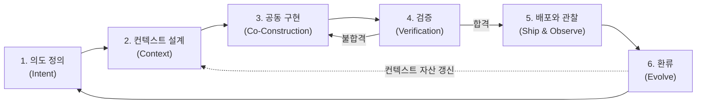

# VDLC: Vibe-Driven Development Lifecycle

**바이브코딩을 전제로 재설계한 소프트웨어 개발 생명주기**

---

## 1. 정의

VDLC(Vibe-Driven Development Lifecycle)는 AI 에이전트가 코드 구현의 주체가 되는 시대에 맞춰 소프트웨어 개발의 전 과정을 재구성한 개발 생명주기다. 인간은 의도를 정의하고 컨텍스트를 설계하며 결과를 검증하고, AI 에이전트는 계획을 제안하고 코드를 생성하며 스스로 점검한다.

전통적인 SDLC는 "인간이 코드를 작성한다"는 가정 위에 세워졌다. 요구분석–설계–구현–테스트–배포로 이어지는 단계 구분도, 스프린트라는 시간 단위도, 코드 리뷰라는 품질 장치도 모두 이 가정에서 출발한다. 바이브코딩은 이 가정을 무너뜨렸다. VDLC는 무너진 가정을 새 가정으로 교체한 뒤, 그 위에서 개발 프로세스를 처음부터 다시 세운 결과물이다.

VDLC의 핵심 명제는 하나다. **의도와 컨텍스트가 1차 산출물이고, 코드는 그로부터 재생성 가능한 2차 산출물이다.**

## 2. 배경: 왜 지금 VDLC인가

2025년 초 안드레이 카파시(Andrej Karpathy)가 '바이브코딩'이라는 이름을 붙인 이후, 자연어로 의도를 전달하면 AI가 동작하는 코드를 만들어내는 개발 방식은 실험을 넘어 실무로 들어왔다. 코드 한 줄을 작성하는 비용은 사실상 0에 수렴하고 있다.

문제는 생명주기의 나머지 구간이 그대로라는 점이다. 구현이 분 단위로 끝나는데 요구 정의는 여전히 회의 몇 번을 거치고, 리뷰는 사람 손을 며칠씩 기다린다. 병목이 '코드를 쓰는 일'에서 '무엇을 만들지 정하는 일'과 '만들어진 것을 믿을 수 있는지 확인하는 일'로 이동한 것이다. 기존 SDLC를 그대로 두고 구현 단계에만 AI를 끼워 넣으면 세 가지 문제가 반복된다.

첫째, **속도 불균형**이다. 구현만 빨라지고 앞뒤 구간이 그대로면 전체 리드타임은 거의 줄지 않고, 조직은 "AI를 도입했는데 왜 빨라지지 않느냐"는 질문에 부딪힌다. 둘째, **품질 리스크**다. 검증 체계 없이 생성 속도만 누리는 개발은 데모에서는 화려하지만 프로덕션에서는 유지보수 불가능한 코드, 이른바 AI 슬롭을 양산한다. 셋째, **지식의 휘발**이다. 프롬프트와 대화 속에 흩어진 의사결정과 도메인 지식은 세션이 끝나면 사라지고, 다음 작업은 다시 맨바닥에서 시작한다.

VDLC는 이 세 문제를 정면으로 다룬다. 병목이 된 구간(의도 정의, 검증)을 생명주기의 중심에 두고, 휘발되던 지식을 컨텍스트 자산으로 축적하는 구조를 만든다.

## 3. 다섯 가지 원칙

**원칙 1 — 의도가 소스다 (Intent as Source).** 프로그래밍 언어로 쓴 코드가 아니라 자연어로 쓴 의도가 개발의 출발점이자 원본이다. 잘 쓴 의도 문서는 한 번 쓰고 버리는 요구사항 명세가 아니라, 에이전트에게 반복 투입되는 실행 가능한 스펙이다. 아마존의 6-pager와 PR-FAQ 같은 내러티브 문서가 좋은 형식인 이유는, 맥락·근거·트레이드오프를 서사로 담아내 에이전트가 행간을 추측할 필요를 줄여주기 때문이다.

**원칙 2 — 인간은 판단하고, AI는 실행한다.** 무엇을 만들지, 어디까지 허용할지, 이 결과를 믿을지는 인간의 몫이다. 어떻게 구현할지, 반복 작업을 어떻게 처리할지는 에이전트의 몫이다. 이 경계가 무너지면 양쪽 모두 사고가 난다. 판단까지 위임하면 통제를 잃고, 실행까지 인간이 붙들면 속도를 잃는다.

**원칙 3 — 속도는 검증이 결정한다 (Verification Sets the Pace).** 생성은 더 이상 병목이 아니다. 전체 리드타임은 "얼마나 빨리 만드느냐"가 아니라 "만들어진 것을 얼마나 빨리 믿을 수 있느냐"가 결정한다. 따라서 테스트, 평가 기준, 리뷰 체계 같은 검증 자산에 투자하는 것이 곧 속도에 투자하는 것이다.

**원칙 4 — 컨텍스트는 자산이다 (Context as Asset).** 프로젝트 규칙(CLAUDE.md), 재사용 가능한 스킬, 도메인 위키, 코딩 컨벤션은 부수적인 문서가 아니라 조직의 핵심 자산이다. 같은 모델을 써도 컨텍스트의 품질에 따라 산출물 품질이 갈린다. VDLC는 사이클을 돌 때마다 이 자산이 두꺼워지고, 자산이 두꺼워질수록 다음 사이클이 빨라지는 복리 구조를 설계한다.

**원칙 5 — 작게 돌리고, 자주 환류한다.** 한 사이클의 단위는 주 단위 스프린트가 아니라 시간과 일이다. 작은 단위로 의도–구현–검증을 돌리고, 각 사이클에서 배운 것을 즉시 컨텍스트에 반영한다.

## 4. 라이프사이클: 여섯 단계

### 1단계 — 의도 정의 (Intent)

무엇을, 왜 만드는지를 사람이 합의하고 문서로 만든다. 산출물은 내러티브 형식의 의도 문서다. PR-FAQ로 완성된 모습을 먼저 그리고, 6-pager 형식으로 배경·제약·트레이드오프를 서술하며, 검증 가능한 성공 기준을 명시한다. 이 단계의 품질이 이후 모든 단계의 상한선을 정한다. 모호한 의도는 에이전트의 추측을 부르고, 추측은 재작업을 부른다.

### 2단계 — 컨텍스트 설계 (Context)

에이전트가 참조할 지식과 규칙을 준비한다. 프로젝트 규칙, 아키텍처 결정 기록, 코딩 컨벤션, 도메인 용어집, 재사용 스킬이 여기에 해당한다. 신규 프로젝트라면 최소한의 골격을 세우고, 기존 프로젝트라면 이전 사이클에서 축적된 자산을 점검하고 갱신한다.

### 3단계 — 공동 구현 (Co-Construction)

에이전트가 계획을 제안하고, 인간이 승인하면, 에이전트가 구현한다. 핵심은 '계획 승인' 관문이다. 코드를 한 줄씩 검토하는 대신 계획 수준에서 방향을 통제하면, 통제력을 유지하면서도 생성 속도를 온전히 누릴 수 있다. 작업은 독립적으로 검증 가능한 작은 단위로 쪼개며, 단위별로 여러 에이전트를 병렬로 오케스트레이션할 수 있다.

### 4단계 — 검증 (Verification)

만들어진 것을 믿을 수 있는지 확인한다. 자동화된 테스트와 정적 분석이 1차 방어선, 별도 에이전트의 교차 리뷰가 2차, 인간 리뷰가 최종 관문이다. 모든 산출물에 같은 강도를 적용하는 대신 리스크에 비례해 검증 강도를 조절한다. 결제·인증·개인정보처럼 실패 비용이 큰 영역은 인간 리뷰를 강화하고, 내부 도구나 프로토타입은 자동 검증 중심으로 가볍게 통과시킨다. 검증에서 발견된 문제는 코드 수정으로 끝내지 않고, 의도 문서나 컨텍스트의 결함까지 추적해 고친다.

### 5단계 — 배포와 관찰 (Ship & Observe)

검증을 통과한 산출물을 배포하고 운영 데이터를 관찰한다. CI/CD 파이프라인과 관측 도구는 VDLC가 작동하기 위한 전제 조건이다. 운영에서 발견된 이슈는 로그, 재현 절차, 기대 동작을 갖춘 재현 가능한 컨텍스트로 정리해 다음 사이클의 입력으로 만든다.

### 6단계 — 환류 (Evolve)

사이클에서 배운 것을 자산에 반영한다. 반복된 지시는 프로젝트 규칙으로, 검증에서 잡힌 실수 패턴은 리뷰 체크리스트로, 새로 정리된 도메인 지식은 위키로 들어간다. 이 단계를 생략하면 VDLC는 그저 빠른 코딩일 뿐이다. 환류가 있어야 사이클을 돌수록 조직이 똑똑해지는 학습 루프가 완성된다.

## 5. 역할의 재정의

VDLC에서 개발자는 코드 작성자가 아니라 세 역할의 결합체가 된다. 의도를 명확한 문서로 벼려내는 **의도 설계자**, 여러 에이전트에게 일을 배분하고 진행을 조율하는 **오케스트레이터**, 결과를 믿을지 판단하는 **검증자**다. 타이핑 숙련도의 가치는 줄고, 문제 정의력과 시스템 설계 감각과 리뷰 안목의 가치가 커진다.

비개발 직군의 참여 범위도 넓어진다. 기획자와 도메인 전문가는 의도 문서 작성의 공동 주체가 되고, 프로토타입 수준의 구현은 직접 수행할 수 있다. 다만 4단계 검증의 최종 책임은 프로덕션 품질을 판단할 수 있는 엔지니어에게 남는다.

## 6. 산출물의 재정의

| 구분 | 전통 SDLC | VDLC |
|---|---|---|
| 1차 산출물 | 코드 | 의도 문서, 컨텍스트 자산, 검증 자산 |
| 코드의 지위 | 수작업으로 만든 원본 | 재생성 가능한 2차 산출물 |
| 문서의 지위 | 코드를 뒤따르는 기록(자주 방치됨) | 코드에 앞서는 스펙(에이전트의 입력) |
| 축적되는 것 | 코드베이스 | 코드베이스 + 컨텍스트 자산 + 평가 기준 |

이 전환의 실무적 의미는 명확하다. 문서화가 개발을 지연시키는 비용이 아니라, 다음 생성의 품질을 끌어올리는 투자로 바뀐다.

## 7. 기존 방법론과의 관계

VDLC는 기존 방법론을 부정하지 않고 그 위에 선다. **애자일**의 반복과 피드백 정신은 그대로 계승하되, 반복 주기를 주 단위 스프린트에서 시간·일 단위 사이클로 압축한다. **DevOps**가 구축한 CI/CD와 관측 인프라는 4단계와 5단계가 작동하기 위한 토대다. **TDD**의 "검증 기준을 먼저 세운다"는 사고는 원칙 3으로 확장된다.

AWS의 **AI-DLC**와는 문제의식을 공유한다. AI-DLC가 Inception–Construction–Operations라는 조직 수준의 청사진과 몹(Mob) 중심의 협업 의례를 제시한다면, VDLC는 바이브코딩 실천을 중심에 두고 개인과 팀이 매일 돌리는 실행 루프와 컨텍스트 자산화 구조를 구체화한다. 두 방법론은 경쟁 관계가 아니라, 조직 관점의 프레임(AI-DLC)과 실무 관점의 사이클(VDLC)로 상호 보완적으로 쓸 수 있다.

## 8. 안티패턴

**검증 없는 바이브.** 생성 속도에 취해 4단계를 건너뛰는 경우다. 초기에는 빠르게 전진하는 듯 보이지만, 이해하지 못한 코드가 쌓이면서 어느 순간부터 수정 하나가 회귀 버그 셋을 낳는다. 데모까지는 도달하고 프로덕션에는 도달하지 못하는 전형적인 경로다.

**컨텍스트 없는 프롬프트.** 매 세션을 맨바닥에서 시작하는 경우다. 같은 지시를 반복하고, 세션마다 스타일과 구조가 달라지며, 팀원 간 산출물의 일관성이 무너진다. 환류(6단계)가 작동하지 않는 조직의 증상이다.

**병목이 된 인간.** 생성은 분 단위인데 리뷰 체계는 예전 그대로인 경우다. 에이전트가 만든 산출물이 리뷰 대기열에 쌓이고, AI 도입 효과가 대기 시간에 잠식된다. 리스크 기반 검증 강도 조절과 에이전트 교차 리뷰 같은 검증 체계의 재설계가 필요하다는 신호다.

**전 구간 자동화 환상.** 판단까지 에이전트에 위임하는 경우다. 요구사항 해석, 아키텍처 선택, 배포 승인 같은 판단 지점에서 인간 관문을 제거하면, 빠르게 잘못된 방향으로 멀리 가게 된다. 원칙 2의 경계는 자동화 수준이 올라가도 유지되어야 한다.

## 9. 도입 경로

조직 도입은 네 걸음으로 권장한다. 먼저 실패 비용이 낮은 내부 도구나 신규 소규모 프로젝트에서 **파일럿**을 돌려 여섯 단계 전체를 경험한다. 다음으로 파일럿에서 나온 규칙과 지식을 **컨텍스트 자산으로 정리**해 재사용 기반을 만든다. 셋째, 테스트 기준·리뷰 규칙·리스크 등급을 갖춘 검증 체계를 세우고 **팀 단위로 확산**한다. 마지막으로 사이클 리드타임, 재작업률, 컨텍스트 자산 증가량 같은 지표를 잡아 **조직 표준으로 정착**시킨다.

## 맺으며

바이브코딩은 도구의 변화가 아니라 가정의 변화다. "인간이 코드를 쓴다"는 가정이 사라진 자리에 무엇을 세울 것인가에 대한 하나의 답이 VDLC다. 의도를 원본으로 삼고, 검증으로 속도를 만들고, 컨텍스트를 복리로 쌓는 조직은, 같은 모델을 쓰는 경쟁자보다 사이클을 돌 때마다 조금씩 더 빨라진다. 그 격차가 누적된 것이 곧 AI 시대의 개발 경쟁력이다.
